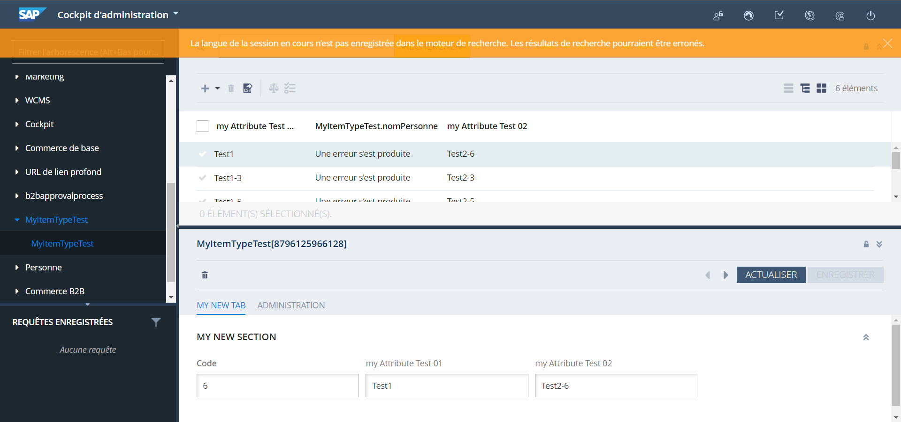

Création d’un nouveau Item qui n’étend de rien 

**Chemin :** `myprojectcore-items.xml`

```xml
<itemtypes>
        <itemtype code="MyItemTypeTest"
                  autocreate="true"
                  generate="true">
            <deployment table="MyItemTypeTests" typecode="12080"/>
            <attributes>
                <attribute qualifier="code" generate="true" autocreate="true" type="java.lang.String">
                    <persistence type="property"/>
                    <modifiers optional="false" unique="true" initial="true"/>
                </attribute>
                <attribute autocreate="true" qualifier="myAttributeTest01" type="java.lang.String">
                    <modifiers read="true" write="true" search="true" optional="true"/>
                    <persistence type="property"/>
                </attribute>
                <attribute autocreate="true" qualifier="myAttributeTest02" type="java.lang.String">
                    <modifiers read="true" write="true" search="true" optional="true"/>
                    <persistence type="property"/>
                </attribute>
            </attributes>
        </itemtype>
```

Lancé `Ant Clean all` et `update sytème`

Ajout d’une nouvelle explorer-tree `MyItemTypeTest`

**Chemin :** `myprojectbackoffice-backoffice-config.xml`

```xml
<context component="explorer-tree"  merge-by="module">
		<n:explorer-tree xmlns:n="http://www.hybris.com/cockpitng/config/explorertree">
			<n:navigation-node id="MyItemTypeTest">
				<n:type-node code="MyItemTypeTest" id="MyItemTypeTest"/>
			</n:navigation-node>
		</n:explorer-tree>
	</context>
```

Ajout d’une `listview` dans `MyItemTypeTest`

**Chemin :** `myprojectbackoffice-backoffice-config.xml`

```xml
<context type="MyItemTypeTest" component="listview">
		<list-view:list-view>
			<list-view:column qualifier="code" />
			<list-view:column qualifier="myAttributeTest01" />
			<list-view:column qualifier="myAttributeTest02" />
		</list-view:list-view>
	</context>
```

Ajout d’une nouvelle Tab et une nouvelle Section

**Chemin :** `myprojectbackoffice-backoffice-config.xml`

```xml
<context merge-by="type"  type="MyItemTypeTest" component="editor-area">
		<editorArea:editorArea>
			<editorArea:tab name="hmc.tab.myItemTypeTest.myNewTab"
							position="1">
				<editorArea:section name="hmc.tab.myItemTypeTest.myNewSection">
					<editorArea:attribute qualifier="code" />
					<editorArea:attribute qualifier="myAttributeTest01" />
					<editorArea:attribute qualifier="myAttributeTest02" />
				</editorArea:section>
			</editorArea:tab>
		</editorArea:editorArea>
	</context>
```

Renommer nos attribues 

**Chemin :** `localization/myprojectbackoffice-locales_en.properties`

**Chemin :** `localization/myprojectbackoffice-locales_fr.properties`

```xml
type.MyItemTypeTest.code.name=Code
type.MyItemTypeTest.myAttributeTest01.name=my Attribute Test 01
type.MyItemTypeTest.myAttributeTest02.name=my Attribute Test 02
```

Nommer notre nouvelle Tab et notre nouvelle Section

**Chemin :**`myprojectbackoffice-backoffice-labels/labels_e.properties`

**Chemin :**`myprojectbackoffice-backoffice-labels/labels_fr.properties`

```xml
hmc.tab.myItemTypeTest.myNewTab =my new tab
hmc.tab.myItemTypeTest.myNewSection=my new section
```

lancer `ant clean all` puis un `update système` avec `localise type` 

**Résultat :** 

