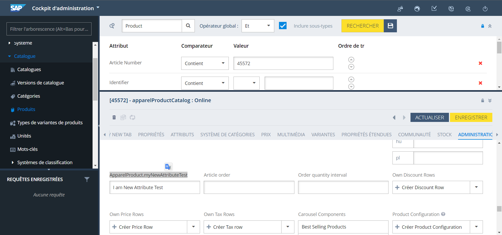
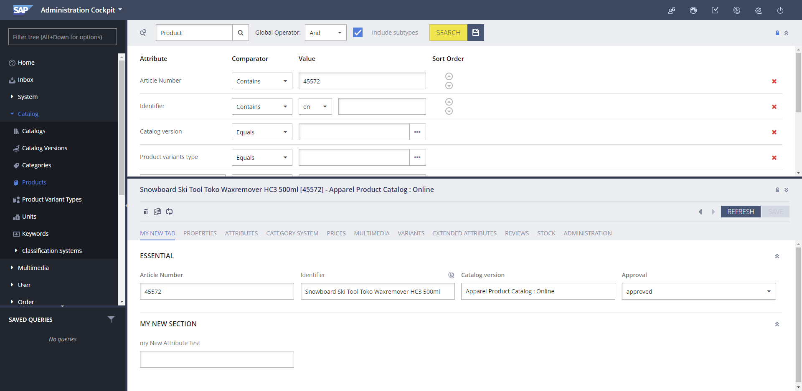
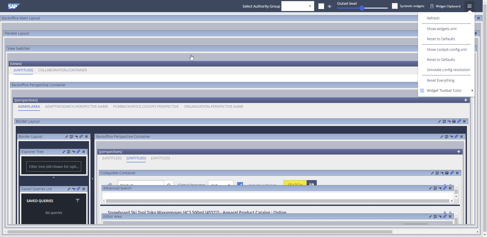

**Chemin :** `myprojectcore-items.xml`

dans le `itemtype code="ApparelProduct"` ajouter l’attribue dans `<attributes>`

```xml

	<attribute qualifier="myNewAttributeTest" type="java.lang.String">
		  <description>my new attribute Test</description>
			<modifiers/> 
			<persistence type="property"/>
   </attribute>
```

Dans le `backoffice` prenais n’importe quel article aller dans administration et vous aller retrouver notre nouveau attribue



Renommer notre attribue 

**Chemin :** `localization/myprojectbackoffice-locales_en.properties`

**Chemin :** `localization/myprojectbackoffice-locales_fr.properties`

```xml
type.apparelProduct.myNewAttributeTest.name=my New Attribute Test
```

Ajout d’une nouvelle Tab et une nouvelle Section

**Chemin :** `myprojectbackoffice-backoffice-config.xml`

```html
<context merge-by="type"  type="ApparelProduct" component="editor-area">
		<editorArea:editorArea>
			<editorArea:tab name="hmc.tab.apparelProduct.myNewTab"
							position="1">
				<editorArea:section name="hmc.section.apparelProduct.myNewSection">
					<editorArea:attribute qualifier="myNewAttributeTest" />
				</editorArea:section>
			</editorArea:tab>
		</editorArea:editorArea>
	</context>
```

Nommer notre nouvelle Tab et notre nouvelle Section

**Chemin :**`myprojectbackoffice-backoffice-labels/labels_e.properties`

**Chemin :**`myprojectbackoffice-backoffice-labels/labels_fr.properties`

```xml
hmc.tab.apparelProduct.myNewTab=my new tab
hmc.section.apparelProduct.myNewSection=my new section
```

lancer `ant clean all` puis un `update système` avec `localise type` 

**Résultat :** 


- PS : si vous n’avez pas les modifications
    
     faite f4 et Reset Everything
    
