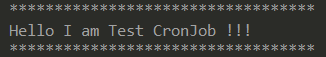
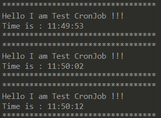
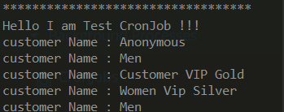

# Création d’un CronJob  Simple

Définition d’un CronJob

**Chemin :** `myprojectcore-items.xml`

```xml
<itemtype generate="true"
          code="TestCronJob"
          jaloclass="de.hybris.myproject.core.jalo.TestCronJob"
          extends="CronJob"
          autocreate="true">

</itemtype>
```

ant clean all 

Création de la class Job 

**Chemin :** `de/hybris/myproject/core/job/TestJob.java`

```java
package de.hybris.myproject.core.job;

import de.hybris.platform.cronjob.enums.CronJobResult;
import de.hybris.platform.cronjob.enums.CronJobStatus;
import de.hybris.platform.cronjob.model.CronJobModel;
import de.hybris.platform.servicelayer.cronjob.AbstractJobPerformable;
import de.hybris.platform.servicelayer.cronjob.PerformResult;

public class TestJob extends AbstractJobPerformable {
    @Override
    public PerformResult perform(CronJobModel cronJobModel) {
        System.out.println("**********************************");
        System.out.println("Hello I am Test CronJob !!!");
        System.out.println("**********************************");
        return new PerformResult(CronJobResult.SUCCESS, CronJobStatus.FINISHED);
    }
}
```

définir la class `testJob` en tant que Spring Beans

**Chemin :** `myprojectcore-spring.xml`

```xml
<bean id="testJob" 
			class="de.hybris.myproject.core.job.TestJob"
		  parent="abstractJobPerformable">
</bean>
```

Création de l’impex 

```xml

INSERT_UPDATE ServicelayerJob ;code[unique=true];springID
;testJob;testJob

INSERT_UPDATE TestCronJob; code[unique=true];job(code);sessionLanguage(isocode);sessionCurrency(isocode)
;TestJob;testJob;en;EUR
```

Exécute le CronJob dans le backOffice  


**Résultat dans le terminal :**



---

# CronJob avec une execution periodique

Modification de la class Job pour afficher l’heur 

**Chemin :** `de/hybris/myproject/core/job/TestJob.java`

```java
package de.hybris.myproject.core.job;

import de.hybris.platform.cronjob.enums.CronJobResult;
import de.hybris.platform.cronjob.enums.CronJobStatus;
import de.hybris.platform.cronjob.model.CronJobModel;
import de.hybris.platform.servicelayer.cronjob.AbstractJobPerformable;
import de.hybris.platform.servicelayer.cronjob.PerformResult;

import java.text.SimpleDateFormat;
import java.util.Date;

public class TestJob extends AbstractJobPerformable {
    @Override
    public PerformResult perform(CronJobModel cronJobModel) {
        SimpleDateFormat s = new SimpleDateFormat("HH:mm:ss");
        Date date = new Date();

        System.out.println("**********************************");
        System.out.println("Hello I am Test CronJob !!!");
        System.out.println("Time is : "+s.format(date));
        System.out.println("**********************************");
        return new PerformResult(CronJobResult.SUCCESS, CronJobStatus.FINISHED);
    }
}
```

Création de l’impex 

```xml

INSERT_UPDATE ServicelayerJob ;code[unique=true];springID
;testJob;testJob

INSERT_UPDATE TestCronJob; code[unique=true];job(code);singleExecutable;sessionLanguage(isocode);sessionCurrency(isocode)
;TestJob;testJob;false;en;EUR
// indique la planification du job

INSERT_UPDATE Trigger;cronjob(code)[unique=true];cronExpression;
TestJob; 0/10 * * * * ?
```

pour `cronExpression` voici un site qui génère une expression en fonction du temps 

https://www.freeformatter.com/cron-expression-generator-quartz.html

Exécute le CronJob dans le backOffice  



---

# CronJob avec un Flexible Search

Modification de la class Job 

**Chemin :** `de/hybris/myproject/core/job/TestJob.java`

```java
package de.hybris.myproject.core.job;

import de.hybris.platform.core.model.user.CustomerModel;
import de.hybris.platform.cronjob.enums.CronJobResult;
import de.hybris.platform.cronjob.enums.CronJobStatus;
import de.hybris.platform.cronjob.model.CronJobModel;
import de.hybris.platform.servicelayer.cronjob.AbstractJobPerformable;
import de.hybris.platform.servicelayer.cronjob.PerformResult;
import de.hybris.platform.servicelayer.search.FlexibleSearchQuery;
import de.hybris.platform.servicelayer.search.FlexibleSearchService;
import de.hybris.platform.servicelayer.search.SearchResult;
import java.util.List;

public class TestJob extends AbstractJobPerformable {
    FlexibleSearchService flexibleSearchService;
    public FlexibleSearchService getFlexibleSearchService() {
        return flexibleSearchService;
    }
    public void setFlexibleSearchService(FlexibleSearchService flexibleSearchService) {
        this.flexibleSearchService = flexibleSearchService;
    }
    @Override
    public PerformResult perform(CronJobModel cronJobModel) {

        final FlexibleSearchQuery flexibleSearchQuery =new FlexibleSearchQuery(
                "SELECT {PK}  FROM {Customer}"
        );
        final SearchResult<CustomerModel> searchResult = flexibleSearchService.search(flexibleSearchQuery);
        final List<CustomerModel> customerModel = searchResult.getResult();

        System.out.println("**********************************");
        System.out.println("Hello I am Test CronJob !!!");
        customerModel.forEach((n) -> System.out.println("customer Name : "+n.getName()));
        System.out.println("**********************************");

        return new PerformResult(CronJobResult.SUCCESS, CronJobStatus.FINISHED);
    }
}
```

définir la class `testJob` en tant que Spring Beans et ajout `flexibleSearchService`

**Chemin :** `myprojectcore-spring.xml`

```xml
<bean id="testJob" 
			class="de.hybris.myproject.core.job.TestJob"
		  parent="abstractJobPerformable">	

	<property name="flexibleSearchService" ref="flexibleSearchService"/>

</bean>
```

Création de l’impex 

```xml

INSERT_UPDATE ServicelayerJob ;code[unique=true];springID
;testJob;testJob

INSERT_UPDATE TestCronJob; code[unique=true];job(code);sessionLanguage(isocode);sessionCurrency(isocode)
;TestJob;testJob;en;EUR
```

Lancer le CronJob

**Résultat :**



---

# CronJob avec Mail

[mail test](https://www.notion.so/mail-test-848cf760376b49b5ad6d2b4e8a176139?pvs=21)

Création d’un nouveau type d'élément `TestEmailProcess`

**Chemin :** `resources/myprojectcore-items.xml` 

```xml
<itemtype code="TestEmailProcess" extends="StoreFrontCustomerProcess"autocreate="true"generate="true" jaloclass="de.hybris.myproject.core.jalo.TestEmailProcess">
	<attributes>
		<attribute qualifier="cart" type="AbstractOrder">
			<persistence type="property"/>
		</attribute>
	</attributes>
</itemtype>
```

Création d’un process.xml qui contient une séquence d'actions

**Chemin : `**myprojectcore/processes/testEmailProcess.xml`

```xml
<process xmlns="http://www.hybris.de/xsd/processdefinition" start="generateTestEmail" name="testEmailProcess" processClass="de.hybris.myproject.core.model.TestEmailProcessModel" onError="error"> 
<action id="generateTestEmail" bean="generateTestEmailAction">
<transition name="OK" to="sendEmail"/> 
<transition name="NOK" to="error"/>
</action>
 <action id="sendEmail" bean="sendEmail">
 <transition name="OK" to="removeSentEmail"/> 
<transition name="NOK" to="failed"/>
 </action> 
<action id="removeSentEmail" bean="removeSentEmail"> 
<transition name="OK" to="success"/>
 <transition name="NOK" to="error"/>
 </action>
 <end id="error" state="ERROR">Something went wrong.</end>
 <end id="failed" state="FAILED">Could not send email for Test.</end> 
<end id="success" state="SUCCEEDED">Sent Test email .</end> 
</process>
```

Ajout de notre **mappage** dans le **spring.xml** du **core**

**Chemin :** `myprojectcore-spring.xml`

```xml
<bean id="testEmailProcessDefinitionResource" class="de.hybris.platform.processengine.definition.ProcessDefinitionResource" >
   <property name="resource" value="classpath:/myprojectcore/processes/testEmailProcess.xml"/>
</bean>
```

```xml
<bean id="generateTestEmailAction" parent="abstractGenerateEmailAction">
 <property name="frontendTemplateName" value="TestEmailTemplate"/>
</bean>
```

Création de notre class **Event** qui est appeler dans le **Controleur** 

**Chemin :** `de/hybris/myproject/core/event/TestEmailEvent.java`

```java
package de.hybris.myproject.core.event;

import de.hybris.platform.basecommerce.model.site.BaseSiteModel;
import de.hybris.platform.commerceservices.event.AbstractCommerceUserEvent;
import de.hybris.platform.core.model.c2l.CurrencyModel;
import de.hybris.platform.core.model.order.AbstractOrderModel;
import de.hybris.platform.store.BaseStoreModel;

public class TestEmailEvent extends AbstractCommerceUserEvent {
   
    private AbstractOrderModel cart;
   
    public TestEmailEvent(final AbstractOrderModel cart, final BaseStoreModel baseStore, final BaseSiteModel site, final CurrencyModel currency){
        this.cart=cart;
       
        setBaseStore(baseStore);
        setSite(site);
        setCurrency(currency);
        setLanguage(cart.getUser().getSessionLanguage());
    }
    public AbstractOrderModel getCart() {
        return cart;
    }
    public void setCart(AbstractOrderModel cart){
        this.cart=cart;
    }
}
```

Création de notre class **EventListener**

**Chemin :** `de/hybris/myproject/core/event/TestEmailEventListener.java`

```java
package de.hybris.myproject.core.event;

import de.hybris.myproject.core.model.TestEmailProcessModel;
import de.hybris.platform.acceleratorservices.site.AbstractAcceleratorSiteEventListener;
import de.hybris.platform.commerceservices.enums.SiteChannel;
import de.hybris.platform.processengine.BusinessProcessService;
import de.hybris.platform.servicelayer.keygenerator.KeyGenerator;
import de.hybris.platform.servicelayer.model.ModelService;
import org.springframework.beans.factory.annotation.Required;

public class TestEmailEventListener extends AbstractAcceleratorSiteEventListener<TestEmailEvent>
{
    private ModelService modelService;
    private BusinessProcessService businessProcessService;
    private KeyGenerator processCodeGenerator;

    protected void onSiteEvent(final TestEmailEvent event)
    {
        final TestEmailProcessModel testEmailProcessModel =(TestEmailProcessModel) getBusinessProcessService().createProcess("testEmail-" +event.getCart().getCode() + "-" + processCodeGenerator.generate().toString(),"testEmailProcess");

        testEmailProcessModel.setCart(event.getCart());
        testEmailProcessModel.setCurrency(event.getCurrency());
        testEmailProcessModel.setLanguage(event.getLanguage());
        testEmailProcessModel.setStore(event.getBaseStore());
        testEmailProcessModel.setSite(event.getSite());
        getModelService().save(testEmailProcessModel);
        getBusinessProcessService().startProcess(testEmailProcessModel);
    }

    @Override
    protected SiteChannel getSiteChannelForEvent(TestEmailEvent event){
        final BaseSiteModel site = event.getSite();
        ServicesUtil.validateParameterNotNullStandardMessage("event.site", site);
        return site.getChannel();
    }

    public ModelService getModelService() {
        return modelService;
    }
    @Required
    public void setModelService(ModelService modelService) {
        this.modelService = modelService;
    }

    public BusinessProcessService getBusinessProcessService() {
        return businessProcessService;
    }
    @Required
    public void setBusinessProcessService(BusinessProcessService businessProcessService) {
        this.businessProcessService = businessProcessService;
    }

    public KeyGenerator getProcessCodeGenerator() {
        return processCodeGenerator;
    }

    public void setProcessCodeGenerator(KeyGenerator processCodeGenerator) {
        this.processCodeGenerator = processCodeGenerator;
    }

}
```

Ajout de notre **mappage** dans le **spring.xml** du **core**

**Chemin :** `myprojectcore-spring.xml`

```xml
<bean id="testEmailEventListener" class="de.hybris.myproject.core.event.TestEmailEventListener" parent="abstractAcceleratorSiteEventListener">
 <property name="modelService" ref="modelService"/>
 <property name="businessProcessService" ref="businessProcessService"/>
 <property name="processCodeGenerator" ref="processCodeGenerator"/>
</bean>
```

Ajout de l’appel de notre **Event** dans le **Controlleur** 

**Chemin :** `de/hybris/myproject/storefront/controllers/pages/CartPageController.java`

```java
@Resource
private EventService eventService;

@Resource(name="cartService")
private CartService cartService;

public EventService getEventService() {
	return eventService;
}
public void setEventService(EventService eventService) {
		this.eventService = eventService;
}
public CartService getCartService() {
	return cartService;
}
public void setCartService(CartService cartService) {
	this.cartService = cartService;
}
@RequestMapping(method = RequestMethod.GET)
public String showCart(final Model model) throws CMSItemNotFoundException{
  
      final CartModel cartModel = getCartService().getSessionCart();
      eventService.publishEvent(initializeEvent(new TestEmailEvent(cartModel,cartModel.getStore(),cartModel.getSite(),cartModel.getCurrency()),cartModel));
     
   return prepareCartUrl(model);
}

private AbstractEvent initializeEvent(TestEmailEvent testEmailEvent,CartModel cartModel)
{
   testEmailEvent.setCart(cartModel);
   return testEmailEvent;
}
```

Création de notre class Context

**Chemin :** `de/hybris/myproject/facades/process/email/context/TestEmailContext.java`

```java
package de.hybris.myproject.facades.process.email.context;

import de.hybris.myproject.core.model.TestEmailProcessModel;
import de.hybris.platform.acceleratorservices.model.cms2.pages.EmailPageModel;
import de.hybris.platform.acceleratorservices.process.email.context.AbstractEmailContext;
import de.hybris.platform.basecommerce.model.site.BaseSiteModel;
import de.hybris.platform.core.model.c2l.LanguageModel;
import de.hybris.platform.core.model.user.CustomerModel;

public class TestEmailContext extends AbstractEmailContext<TestEmailProcessModel> {

    public void init(final TestEmailProcessModel testEmailProcessModel, final EmailPageModel emailPageModel)
    {
        super.init(testEmailProcessModel, emailPageModel);
        put(EMAIL, getCustomerEmailResolutionService().getEmailForCustomer(getCustomer(testEmailProcessModel)));
        put(DISPLAY_NAME, getCustomer(testEmailProcessModel).getDisplayName());
    }
    @Override
    protected BaseSiteModel getSite(TestEmailProcessModel businessProcessModel) {
        return businessProcessModel.getCart().getSite();
    }

    @Override
    protected CustomerModel getCustomer(TestEmailProcessModel businessProcessModel) {
        return (CustomerModel) businessProcessModel.getCart().getUser();
    }

    @Override
    protected LanguageModel getEmailLanguage(TestEmailProcessModel businessProcessModel) {
        return businessProcessModel.getCart().getUser().getSessionLanguage();
    }
}
```

Ajout de notre **mappage** dans le **spring.xml** de la **facade**

**Chemin :** `myprojectfacades-spring.xml`

```xml
<bean id="testEmailContext" class="de.hybris.myproject.facades.process.email.context.TestEmailContext" parent="abstractEmailContext" scope="prototype"> </bean>
```

Création de nos mail 

**Chemin :** `myprojectcore/import/emails/email-testEmailSubject.vm`

```html
ceci est un test Subject
```

**Chemin :** `myprojectcore/import/emails/email-testEmailBody.vm`

```html
<html>
    <head>Test</head>
    <body>
        <p>ceci est un test Body</p>
    </body>
</html>
```

**Notre Impex :**

```xml
$contentCatalog=apparel-ukContentCatalog
$contentCV=catalogVersion(CatalogVersion.catalog(Catalog.id[default=$contentCatalog]),CatalogVersion.version[default=Online])[default=$contentCatalog:Online]
$wideContent=CMSImageComponent,BannerComponent
# Import modulegen config properties into impex macros
UPDATE GenericItem[processor=de.hybris.platform.commerceservices.impex.impl.ConfigPropertyImportProcessor];pk[unique=true]
$jarResourceCms=$config-jarResourceCmsValue
$emailPackageName=de.hybris.myproject.facades.process.email.context
$emailResource=jar:de.hybris.myproject.core.setup.CoreSystemSetup&/myprojectcore/import/emails
$lang=en

INSERT_UPDATE RendererTemplate;code[unique=true];contextClass;rendererType(code)[default='velocity']
;testEmailBody;$emailPackageName.TestEmailContext
;testEmailSubject;$emailPackageName.TestEmailContext

UPDATE RendererTemplate;code[unique=true];description[lang=$lang];templateScript[lang=$lang,translator=de.hybris.platform.commerceservices.impex.impl.FileLoaderValueTranslator]
;testEmailBody;"Test Email Body";$emailResource/email-testEmailBody.vm
;testEmailSubject;"Test Email Subject";$emailResource/email-testEmailSubject.vm

INSERT_UPDATE EmailPageTemplate;$contentCV[unique=true];uid[unique=true];name;active;frontendTemplateName;subject(code);htmlTemplate(code);restrictedPageTypes(code)
;;TestEmailTemplate;Test Email Template;true;TestEmail;testEmailSubject;testEmailBody;EmailPage

INSERT_UPDATE EmailPage;$contentCV[unique=true];uid[unique=true];name;masterTemplate(uid,$contentCV);defaultPage;approvalStatus(code)[default='approved'];fromEmail[lang=en];fromName[lang=en]
;;TestEmail;Test Email;TestEmailTemplate;true;;customerservices@hybris.com;Hybris Test

INSERT_UPDATE ContentSlotName;name[unique=true];template(uid,$contentCV)[unique=true][default='TestEmailTemplate'];validComponentTypes(code)
;SiteLogo;;;logo
;TopContent;;$wideContent;
;BottomContent;;$wideContent;

INSERT_UPDATE ContentSlotForTemplate;$contentCV[unique=true];uid[unique=true];position[unique=true];pageTemplate(uid,$contentCV)[unique=true][default='TestEmailTemplate'];contentSlot(uid,$contentCV)[unique=true];allowOverwrite
;;SiteLogo-TestEmail;SiteLogo;;EmailSiteLogoSlot;true
;;TopContent-TestEmail;TopContent;;DeliverySentEmailTopSlot;true
;;BottomContent-TestEmail;BottomContent;;EmailBottomSlot;true
```