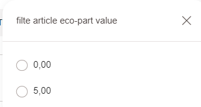

# (Filre) Création d’un filtre EcoTaxe

## Création d’un filtre EcoTaxe True / false

création du résolveur `FbEcotaxeResolver`

chemin : `hybris/bin/custom/fb/fbcore/src/fr/fb/core/solr/provider/FbEcotaxeResolver.java`

```java
public class FbEcotaxeResolver extends AbstractValueResolver<ProductModel, FeatureList, Object> {
    @Override
    protected void addFieldValues(InputDocument inputDocument, IndexerBatchContext indexerBatchContext, IndexedProperty indexedProperty, ProductModel productModel, ValueResolverContext<FeatureList, Object> valueResolverContext) throws FieldValueProviderException {
    
        double i=1;

        if (productModel instanceof FBVariantProductModel) {
            if(productModel.getEcotax()!=null){
                if (productModel.getEcotax()>i) {

                    inputDocument.addField(indexedProperty, "true", valueResolverContext.getFieldQualifier());
                }else{
                    inputDocument.addField(indexedProperty, "false", valueResolverContext.getFieldQualifier());
                }
            }else{
                inputDocument.addField(indexedProperty, "false", valueResolverContext.getFieldQualifier());
            }
        } else if (productModel instanceof FBProductModel){
            Collection<VariantProductModel> variants = productModel.getVariants();
            for (VariantProductModel variantProductModel:
                    variants) {
                if(variantProductModel.getEcotax()!=null){
                    if (variantProductModel.getEcotax()>i) {

                        inputDocument.addField(indexedProperty, "true", valueResolverContext.getFieldQualifier());
                    }else{
                        inputDocument.addField(indexedProperty, "false", valueResolverContext.getFieldQualifier());
                    }
                }else{
                    inputDocument.addField(indexedProperty, "false", valueResolverContext.getFieldQualifier());
                }
            }

        }

    }
}
```

creation de la liaison IOC  

chemin : `hybris/bin/custom/fb/fbcore/resources/fbcore-spring.xml`

```xml
	<bean id="fbEcotaxeResolver"
		  class="fr.fb.core.solr.provider.FbEcotaxeResolver" parent="abstractValueResolver">
	</bean>
```

creation du fichier impex 

```
$productSolrIndexedType = fbProductType

INSERT_UPDATE SolrIndexedProperty; solrIndexedType(identifier)[unique = true]; displayName[lang = fr]; name[unique = true]; type(code); localized[default = false]; multiValue[default = true]; facet[default = true]; facetType(code); facetSort(code); priority; visible; categoryField[default = false]; fieldValueProvider;
; $productSolrIndexedType; filte article eco-part; filtre_ecotaxe; boolean;;;; Refine;Alpha;0;true;; fbEcotaxeResolver;
```

## Création d’un filtre EcoTaxe avec les valeurs

création du résolveur `FbExotaxeResolverValue` 

chemin : `hybris/bin/custom/fb/fbcore/src/fr/fb/core/solr/provider/FbExotaxeResolverValue .java`

```java
package fr.fb.core.solr.provider;

import de.hybris.platform.classification.features.FeatureList;
import de.hybris.platform.core.model.product.ProductModel;
import de.hybris.platform.solrfacetsearch.config.IndexedProperty;
import de.hybris.platform.solrfacetsearch.config.exceptions.FieldValueProviderException;
import de.hybris.platform.solrfacetsearch.indexer.IndexerBatchContext;
import de.hybris.platform.solrfacetsearch.indexer.spi.InputDocument;
import de.hybris.platform.solrfacetsearch.provider.impl.AbstractValueResolver;
import de.hybris.platform.variants.model.VariantProductModel;
import fr.fb.core.model.product.FBProductModel;
import fr.fb.core.model.product.FBVariantProductModel;

import java.util.Collection;

public class FbExotaxeResolverValue extends AbstractValueResolver<ProductModel, FeatureList, Object> {
    protected void addFieldValues(InputDocument inputDocument, IndexerBatchContext indexerBatchContext, IndexedProperty indexedProperty, ProductModel productModel, AbstractValueResolver.ValueResolverContext<FeatureList, Object> valueResolverContext) throws FieldValueProviderException {

        if (productModel instanceof FBVariantProductModel) {
            if (productModel.getEcotax() != null) {
                inputDocument.addField(indexedProperty, productModel.getEcotax(), valueResolverContext.getFieldQualifier());
            } 
        } else if (productModel instanceof FBProductModel) {
            Collection<VariantProductModel> variants = productModel.getVariants();
            for (VariantProductModel variantProductModel : variants) {
                if (variantProductModel.getEcotax() != null) {
                    inputDocument.addField(indexedProperty, productModel.getEcotax(), valueResolverContext.getFieldQualifier());
                } 
            }
        }
    }
}
```

creation de la liaison IOC  

chemin : `hybris/bin/custom/fb/fbcore/resources/fbcore-spring.xml`

```java
<bean id="fbExotaxeResolverValue"
		  class="fr.fb.core.solr.provider.FbExotaxeResolverValue" parent="abstractValueResolver">
	</bean>
```

creation du fichier impex 

```html
$productSolrIndexedType = fbProductType

INSERT_UPDATE SolrIndexedProperty; solrIndexedType(identifier)[unique = true]; displayName[lang = fr]; name[unique = true]; type(code); localized[default = false]; multiValue[default = true]; facet[default = true]; facetType(code); facetSort(code); priority; visible; categoryField[default = false]; fieldValueProvider;
                                 ; $productSolrIndexedType                   ; filte article eco-part value          ; filtre_ecotaxe_value         ; string    ;                           ;                           ;                      ; Refine         ; Alpha          ; 0      ; true   ;                               ; fbExotaxeResolverValue;
```

**PS**: concernant le type de selection il faut voir `SolrIndexedPropertyFacetType` 

**Résultat :**

