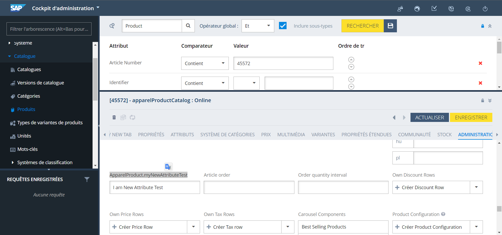
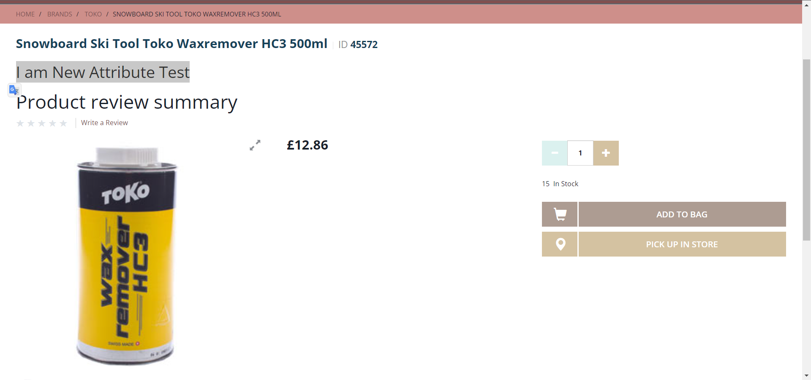

# (Item) Création d’un nouvel item qui n’étend de rien

**Chemin :** `myprojectcore-items.xml`

dans le `itemtype code="ApparelProduct"` ajouter l’attribue dans `<attributes>`

```xml

	<attribute qualifier="myNewAttributeTest" type="java.lang.String">
		  <description>my new attribute Test</description>
			<modifiers/> 
			<persistence type="property"/>
   </attribute>
```

**Chemin :** `myprojectfacades-beans.xml`

```xml
<bean class="de.hybris.platform.commercefacades.product.data.ProductData">
		<property name="genders" type="java.util.List&lt;de.hybris.myproject.facades.product.data.GenderData>"/>
		<property name="myNewAttributeTest" type="java.lang.String"/>
	</bean>
```

Lancer `ant clean all` puis `*Hybrisserver.bat`* 

Accéder au HAC et lancer une Update du système 

Exécuter la requête `FlexibelSearch` pour bien vérifier la presence de notre attribue 

```sql
Select * from {product}
```

Ajouter dans notre populator notre nouveau attribue :

**Chemin :** `de/hybris/myproject/facades/populators/ApparelProductPopulator.java`

dans la fonction `populate` sous la condition `if (baseProduct instanceof ApparelProductModel)`

```java
if(apparelProductModel.getMyNewAttributeTest()!=null){
	target.setMyNewAttributeTest(apparelProductModel.getMyNewAttributeTest());
}
```

Ajouter dans une JSP  

**Chemin :** `web/webroot/WEB-INF/tags/responsive/product/productDetailsPanel.tag`

```html
${product.myNewAttributeTest}
```

Dans le `backoffice` prenais n’importe quel article aller dans administration et vous aller retrouver notre nouveau attribue


Résultat sur le `storeFront` : 

