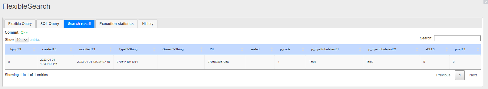
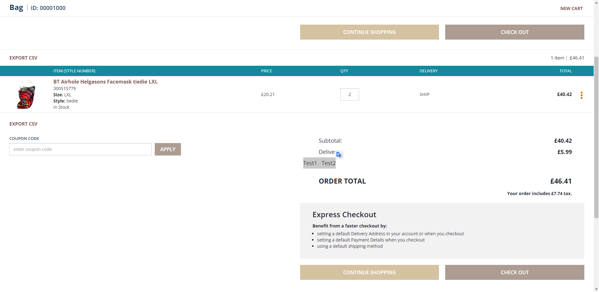
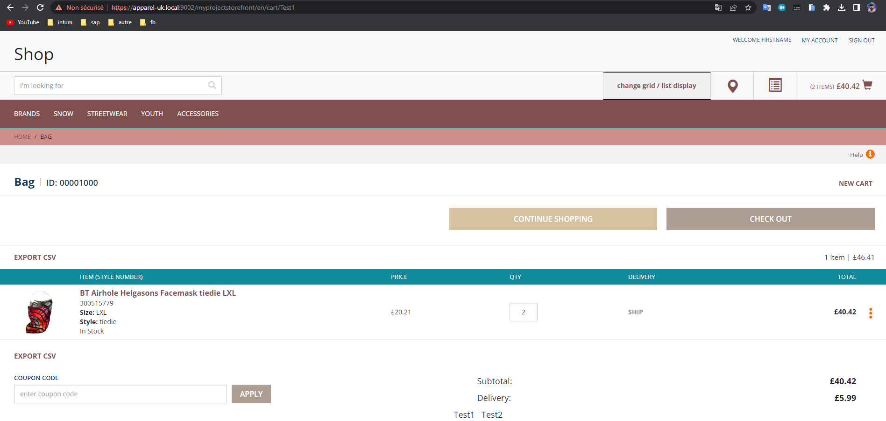

# (Item) Création d’un nouvel item qui n’étend de rien
### **Step 1 :**

Création d’un nouveau Item

**Chemin :** `myprojectcore-items.xml`

```xml
<itemtypes>
        <itemtype code="MyItemTypeTest"
                  autocreate="true"
                  generate="true">
            <deployment table="MyItemTypeTests" typecode="12080"/>
            <attributes>
                <attribute qualifier="code" generate="true" autocreate="true" type="java.lang.String">
                    <persistence type="property"/>
                    <modifiers optional="false" unique="true" initial="true"/>
                </attribute>
                <attribute autocreate="true" qualifier="myAttributeTest01" type="java.lang.String">
                    <modifiers read="true" write="true" search="true" optional="true"/>
                    <persistence type="property"/>
                </attribute>
                <attribute autocreate="true" qualifier="myAttributeTest02" type="java.lang.String">
                    <modifiers read="true" write="true" search="true" optional="true"/>
                    <persistence type="property"/>
                </attribute>
            </attributes>
        </itemtype>
```

Lancé `Ant Clean all` et `update sytème`

Ajouter des informations dans mon `item`

**Impex**

```xml
INSERT_UPDATE MyItemTypeTest;code[unique=true];myAttributeTest01;myAttributeTest02
	;1;Test1;Test2
```

**Requête Flexible Search**

```sql
select * from {MyItemTypeTest}
```

**Résultat Flexible Search**


### **Step 2 :**

Création de l’interface DAO `MyItemTypeTestDao`

**Chemin :** `de/hybris/myproject/core/suggestion/dao/MyItemTypeTestDao.java`

```java
package de.hybris.myproject.core.suggestion.dao;
import de.hybris.myproject.core.model.MyItemTypeTestModel;
import java.util.List;

public interface MyItemTypeTestDao {
    List<MyItemTypeTestModel> findListDao();
    List<MyItemTypeTestModel> findListByMyAttributeTest01Dao(String param);
}
```

Création de l’implémentation DAO`MyItemTypeTestDaoImpl`

**Chemin :** `de/hybris/myproject/core/suggestion/dao/impl/MyItemTypeTestDaoImpl.java`

```java
package de.hybris.myproject.core.suggestion.dao.impl;
import de.hybris.myproject.core.model.MyItemTypeTestModel;
import de.hybris.myproject.core.suggestion.dao.MyItemTypeTestDao;
import de.hybris.platform.servicelayer.search.FlexibleSearchService;
import de.hybris.platform.servicelayer.search.SearchResult;
import java.util.HashMap;
import java.util.List;
import java.util.Map;

public class MyItemTypeTestDaoImpl implements MyItemTypeTestDao {

    FlexibleSearchService flexibleSearchService;
    public FlexibleSearchService getFlexibleSearchService() {
        return flexibleSearchService;
    }
    public void setFlexibleSearchService(FlexibleSearchService flexibleSearchService) {
        this.flexibleSearchService = flexibleSearchService;
    }
    
    @Override
    public List<MyItemTypeTestModel> findListByMyAttributeTest01Dao(String param){
        final Map<String, Object> params = new HashMap<String, Object>();
        String query = "SELECT {p.PK} FROM {MyItemTypeTest AS p} WHERE {p:myAttributeTest01} LIKE ?param";
        params.put("param",param);
        final SearchResult<MyItemTypeTestModel> searchResult = flexibleSearchService.search(query, params);
        return searchResult.getResult();
    }

    @Override
    public List<MyItemTypeTestModel> findListDao() {
        final Map<String, Object> params = new HashMap<String, Object>();
        String query = "SELECT {p.PK}  FROM {MyItemTypeTest AS p}";
        final SearchResult<MyItemTypeTestModel> searchResult = flexibleSearchService.search(query);
        return searchResult.getResult();
    }
}
```

**Chemin :** `myprojectcore-spring.xml`

```xml
<bean id="myItemTypeTestDao1" 
			class="de.hybris.myproject.core.suggestion.dao.impl.MyItemTypeTestDaoImpl" >
	<property name="flexibleSearchService" ref="flexibleSearchService"/>
</bean>
```

### **Step 3 :**

Création de l’interface Service

**Chemin :** `de/hybris/myproject/core/suggestion/MyItemTypeTestService.java`

```java
package de.hybris.myproject.core.suggestion;
import de.hybris.myproject.core.model.MyItemTypeTestModel;
import java.util.List;

public interface MyItemTypeTestService {
    List<MyItemTypeTestModel> findListService();
    List<MyItemTypeTestModel> findListByMyAttributeTest01Service(String param);
}
```

Création de l’implémentation Service

**Chemin :** `de/hybris/myproject/core/suggestion/impl/MyItemTypeTestServiceImpl.java`

```java
package de.hybris.myproject.core.suggestion.impl;
import de.hybris.myproject.core.model.MyItemTypeTestModel;
import de.hybris.myproject.core.suggestion.MyItemTypeTestService;
import de.hybris.myproject.core.suggestion.dao.MyItemTypeTestDao;
import java.util.List;

public class MyItemTypeTestServiceImpl implements MyItemTypeTestService {

    private MyItemTypeTestDao myItemTypeTestDao2;
    public MyItemTypeTestDao getMyItemTypeTestDao2() {
        return myItemTypeTestDao2;
    }
    public void setMyItemTypeTestDao2(MyItemTypeTestDao myItemTypeTestDao2) {
        this.myItemTypeTestDao2 = myItemTypeTestDao2;
    }
    
    @Override
    public List<MyItemTypeTestModel> findListService() {
        return getMyItemTypeTestDao2().findListDao();
    }

    @Override
    public List<MyItemTypeTestModel> findListByMyAttributeTest01Service(String param) {
        return getMyItemTypeTestDao2().findListByMyAttributeTest01Dao(param);
    }
}
```

Faire le mappage du Service

**Chemin :** `myprojectcore-spring.xml`

```xml
<bean id="myItemTypeTestService" 
			class="de.hybris.myproject.core.suggestion.impl.MyItemTypeTestServiceImpl" >
	<property name="myItemTypeTestDao2" ref="myItemTypeTestDao1"/>
</bean>
```

### **Step 4 :**

Création de `MyItemTypeTestData` qui est `Converter`

**Chemin :** `myprojectfacades-beans.xml`

```xml
<bean class="de.hybris.myproject.facades.product.data.MyItemTypeTestData">
   <property name="code" type="java.lang.String"/>
   <property name="myAttributeTest01" type="java.lang.String"/>
   <property name="myAttributeTest02" type="java.lang.String"/>
</bean>
```

Création du Populator

**Chemin :** `de/hybris/myproject/facades/populators/MyItemTypeTestDataPopulator.java`

```java
package de.hybris.myproject.facades.populators;
import de.hybris.myproject.core.model.MyItemTypeTestModel;
import de.hybris.myproject.facades.product.data.MyItemTypeTestData;
import de.hybris.platform.converters.Populator;
import de.hybris.platform.servicelayer.dto.converter.ConversionException;

public class MyItemTypeTestDataPopulator implements Populator<MyItemTypeTestModel, MyItemTypeTestData> {

    @Override
    public void populate(MyItemTypeTestModel myItemTypeTestModel, MyItemTypeTestData myItemTypeTestData) throws ConversionException {
        myItemTypeTestData.setCode(myItemTypeTestModel.getCode());
        myItemTypeTestData.setMyAttributeTest01(myItemTypeTestModel.getMyAttributeTest01());
        myItemTypeTestData.setMyAttributeTest02(myItemTypeTestModel.getMyAttributeTest02());
    }
}
```

Faire le mappage du Populator

**Chemin :** `myprojectfacades-spring.xml`

```xml
<bean id="myItemTypeTestDataPopulator" class="de.hybris.myproject.facades.populators.MyItemTypeTestDataPopulator"/>
```

Faire le mappage du Converter

**Chemin :** `myprojectfacades-spring.xml`

```xml
<bean id="myItemTypeTestDataConverter" 
			parent="abstractPopulatingConverter">
		<property name="targetClass" 
							value="de.hybris.myproject.facades.product.data.MyItemTypeTestData"/>
		<property name="populators">
			<list>
				<ref bean="myItemTypeTestDataPopulator"/>
			</list>
		</property>
	</bean>
```

### **Step 5 :**

Création de l’interface Facade 

**Chemin :** `de/hybris/myproject/facades/suggestion/MyItemTypeTestFacade.java`

```java
package de.hybris.myproject.facades.suggestion;
import de.hybris.myproject.facades.product.data.MyItemTypeTestData;
import java.util.List;

public interface MyItemTypeTestFacade {
    List<MyItemTypeTestData> findListFacade();
    List<MyItemTypeTestData> findListByMyAttributeTest01Facade(String param);
}
```

Création de l’implement Facade 

**Chemin :** `de/hybris/myproject/facades/suggestion/impl/MyItemTypeTestFacadeImpl.java`

```java
package de.hybris.myproject.facades.suggestion.impl;

import de.hybris.myproject.core.model.MyItemTypeTestModel;
import de.hybris.myproject.core.suggestion.MyItemTypeTestService;
import de.hybris.myproject.facades.product.data.MyItemTypeTestData;
import de.hybris.myproject.facades.suggestion.MyItemTypeTestFacade;
import de.hybris.platform.converters.Converters;
import de.hybris.platform.servicelayer.dto.converter.Converter;
import java.util.List;

public class MyItemTypeTestFacadeImpl implements MyItemTypeTestFacade{

    private Converter<MyItemTypeTestModel, MyItemTypeTestData> myItemTypeTestDataConverter;
    public Converter<MyItemTypeTestModel, MyItemTypeTestData> getMyItemTypeTestDataConverter() {
        return myItemTypeTestDataConverter;
    }
    public void setMyItemTypeTestDataConverter(Converter<MyItemTypeTestModel, MyItemTypeTestData> myItemTypeTestDataConverter) {
        this.myItemTypeTestDataConverter = myItemTypeTestDataConverter;
    }

    private MyItemTypeTestService myItemTypeTestService;
    public MyItemTypeTestService getMyItemTypeTestService() {
        return myItemTypeTestService;
    }
    public void setMyItemTypeTestService(MyItemTypeTestService myItemTypeTestService) {
        this.myItemTypeTestService = myItemTypeTestService;
    }

    @Override
    public List<MyItemTypeTestData> findListFacade() {
        final List<MyItemTypeTestModel> suggestions = getMyItemTypeTestService().findListService();
        return Converters.convertAll(suggestions, getMyItemTypeTestDataConverter());
    }

    @Override
    public List<MyItemTypeTestData> findListByMyAttributeTest01Facade(String param) {
        final List<MyItemTypeTestModel> suggestions = getMyItemTypeTestService().findListByMyAttributeTest01Service(param);

        return Converters.convertAll(suggestions, getMyItemTypeTestDataConverter());
    }
}
```

**Chemin :** `*myprojectfacades-spring.xml*` 

```xml
<bean id="myItemTypeTestFacade" 
			class="de.hybris.myproject.facades.suggestion.impl.MyItemTypeTestFacadeImpl" >
		<property name="myItemTypeTestDataConverter" ref="myItemTypeTestDataConverter"/>
		<property name="myItemTypeTestService" ref="myItemTypeTestService"/>
</bean>
```

### **Step 6 - 1 :**

**Appel de notre Facade dans le contrôleur premiere méthode :**  

**Chemin :** `de/hybris/myproject/storefront/controllers/pages/CartPageController.java`

```java
@Resource(name = "myItemTypeTestFacade")
	private MyItemTypeTestFacade myItemTypeTestFacade;
```

Ajouter dans la fonction  `prepareDataForPage`

```java
String myAttributeTest01 = "Test1";
final List<MyItemTypeTestData> myItemTypeTestData =  myItemTypeTestFacade.findListByMyAttributeTest01(myAttributeTest01);
model.addAttribute("listByMyAttributeTest01", myItemTypeTestData);
```

Ajout dans notre tag du nouveau attribute 

**Chemin :** `myprojectstorefront\web\webroot\WEB-INF\tags\responsive\cart\cartTotals.tag`

```xml
<c:forEach items="${listByMyAttributeTest01}" var="n" >
   <p> ${n.myAttributeTest01} &nbsp; ${n.myAttributeTest02}</p>
</c:forEach>
```

**Résultat :** 


### **Step 6 - 2 :**

**Appel de notre Facade dans le contrôleur deuxième méthode :** 

le param de `findListByMyAttributeTest01Facade` est appeler grâce a param URL

**Chemin :** `de/hybris/myproject/storefront/controllers/pages/CartPageController.java`

```java
@Resource(name = "myItemTypeTestFacade")
	private MyItemTypeTestFacade myItemTypeTestFacade;

@RequestMapping(value = "/{myAttribute}", method = RequestMethod.GET)
public String myFunction(@PathVariable(value="myAttribute") String myAttribute,final Model model) throws CMSItemNotFoundException {
	final List<MyItemTypeTestData> myItemTypeTestData =  myItemTypeTestFacade.findListByMyAttributeTest01Facade(myAttribute);
	model.addAttribute("listMyAttributeTest01", myItemTypeTestData);
	return prepareCartUrl(model);
}
```

Ajout dans notre tag du nouveau attribute 

**Chemin :** `myprojectstorefront\web\webroot\WEB-INF\tags\responsive\cart\cartTotals.tag`

```html
<c:forEach items="${listMyAttributeTest01}" var="n" >
  <p> ${n.myAttributeTest01} &nbsp; ${n.myAttributeTest02}</p>
</c:forEach>
```

**Résultat :** 

