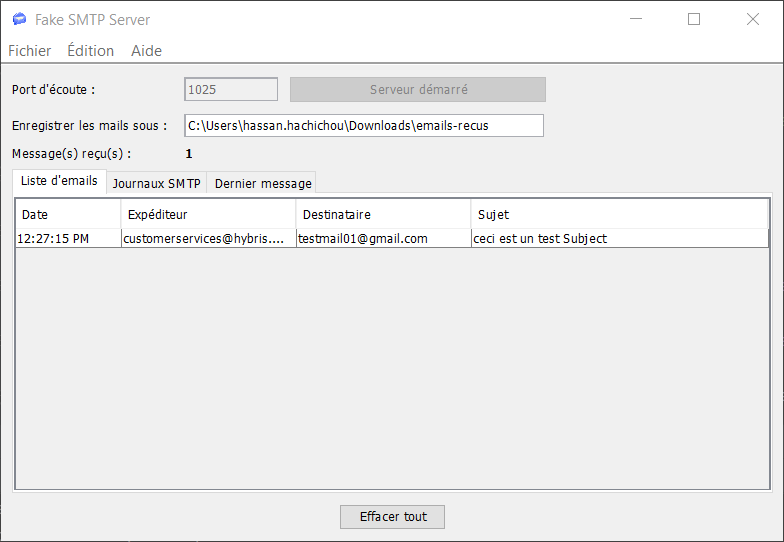
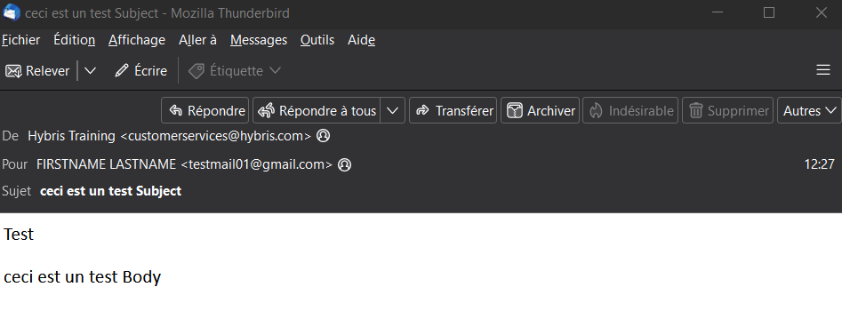
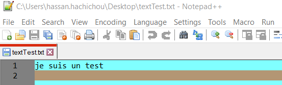
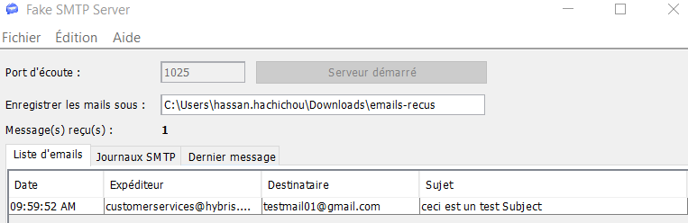
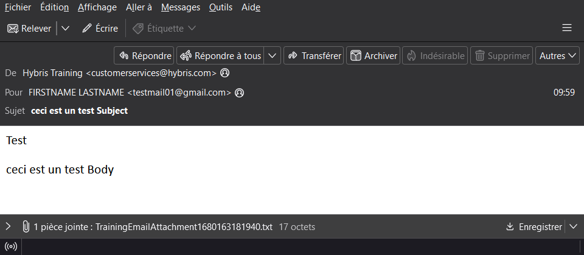
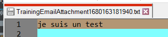

# Création d’un mail simple

Création d’un nouveau type d'élément `TrainingEmailProcess`

**Chemin :** `resources/myprojectcore-items.xml` 

```xml
<itemtype code="TrainingEmailProcess"extends="StoreFrontCustomerProcess"autocreate="true"generate="true" jaloclass="de.hybris.myproject.core.jalo.TrainingEmailProcess">
	<attributes>
		<attribute qualifier="cart" type="AbstractOrder">
			<persistence type="property"/>
		</attribute>
	</attributes>
</itemtype>
```

<aside>
⚠️ PS: lancé un ant clean all

</aside>

Création d’un process.xml qui contient une séquence d'actions

**Chemin : `**myprojectcore/processes/trainingEmailProcess.xml`

```xml
<process xmlns="http://www.hybris.de/xsd/processdefinition" start="generateTrainingEmail" name="trainingEmailProcess" processClass="de.hybris.myproject.core.model.TrainingEmailProcessModel" onError="error"> 
<action id="generateTrainingEmail" bean="generateTrainingEmailAction">
<transition name="OK" to="sendEmail"/> 
<transition name="NOK" to="error"/>
</action>
 <action id="sendEmail" bean="sendEmail">
 <transition name="OK" to="removeSentEmail"/> 
<transition name="NOK" to="failed"/>
 </action> 
<action id="removeSentEmail" bean="removeSentEmail"> 
<transition name="OK" to="success"/>
 <transition name="NOK" to="error"/>
 </action>
 <end id="error" state="ERROR">Something went wrong.</end>
 <end id="failed" state="FAILED">Could not send email for Training.</end> 
<end id="success" state="SUCCEEDED">Sent Training email .</end> 
</process>
```

Ajout de notre **mappage** dans le **spring.xml** du **core**

**Chemin :** `myprojectcore-spring.xml`

```xml
<bean id="trainingEmailProcessDefinitionResource" class="de.hybris.platform.processengine.definition.ProcessDefinitionResource" >
   <property name="resource" value="classpath:/myprojectcore/processes/trainingEmailProcess.xml"/>
</bean>
```

```xml
<bean id="generateTrainingEmailAction" parent="abstractGenerateEmailAction">
 <property name="frontendTemplateName" value="TrainingEmailTemplate"/>
</bean>
```

Création de notre class **Event** qui est appeler dans le **Controleur** 

**Chemin :** `de/hybris/myproject/core/event/TrainingEmailEvent.java`

```java
package de.hybris.myproject.core.event;

import de.hybris.platform.basecommerce.model.site.BaseSiteModel;
import de.hybris.platform.commerceservices.event.AbstractCommerceUserEvent;
import de.hybris.platform.core.model.c2l.CurrencyModel;
import de.hybris.platform.core.model.order.AbstractOrderModel;
import de.hybris.platform.store.BaseStoreModel;

public class TrainingEmailEvent extends AbstractCommerceUserEvent {
   
    private AbstractOrderModel cart;
   
    public TrainingEmailEvent(final AbstractOrderModel cart, final BaseStoreModel baseStore, final BaseSiteModel site, final CurrencyModel currency){
        this.cart=cart;
       
        setBaseStore(baseStore);
        setSite(site);
        setCurrency(currency);
        setLanguage(cart.getUser().getSessionLanguage());
    }
    public AbstractOrderModel getCart() {
        return cart;
    }
    public void setCart(AbstractOrderModel cart){
        this.cart=cart;
    }
}
```

Création de notre class **EventListener**

**Chemin :** `de/hybris/myproject/core/event/TrainingEmailEventListener.java`

```java
package de.hybris.myproject.core.event;

import de.hybris.myproject.core.model.TrainingEmailProcessModel;
import de.hybris.platform.acceleratorservices.site.AbstractAcceleratorSiteEventListener;
import de.hybris.platform.commerceservices.enums.SiteChannel;
import de.hybris.platform.processengine.BusinessProcessService;
import de.hybris.platform.servicelayer.keygenerator.KeyGenerator;
import de.hybris.platform.servicelayer.model.ModelService;
import org.springframework.beans.factory.annotation.Required;

public class TrainingEmailEventListener extends AbstractAcceleratorSiteEventListener<TrainingEmailEvent>
{
    private ModelService modelService;
    private BusinessProcessService businessProcessService;
    private KeyGenerator processCodeGenerator;

    protected void onSiteEvent(final TrainingEmailEvent event)
    {
        final TrainingEmailProcessModel trainingEmailProcessModel =(TrainingEmailProcessModel) getBusinessProcessService().createProcess("trainingEmail-" +event.getCart().getCode() + "-" + processCodeGenerator.generate().toString(),"trainingEmailProcess");

        trainingEmailProcessModel.setCart(event.getCart());
        trainingEmailProcessModel.setCurrency(event.getCurrency());
        trainingEmailProcessModel.setLanguage(event.getLanguage());
        trainingEmailProcessModel.setStore(event.getBaseStore());
        trainingEmailProcessModel.setSite(event.getSite());
        getModelService().save(trainingEmailProcessModel);
        getBusinessProcessService().startProcess(trainingEmailProcessModel);
    }

    @Override
    protected SiteChannel getSiteChannelForEvent(TrainingEmailEvent event){
        final BaseSiteModel site = event.getSite();
        ServicesUtil.validateParameterNotNullStandardMessage("event.site", site);
        return site.getChannel();
    }

    public ModelService getModelService() {
        return modelService;
    }
    @Required
    public void setModelService(ModelService modelService) {
        this.modelService = modelService;
    }

    public BusinessProcessService getBusinessProcessService() {
        return businessProcessService;
    }
    @Required
    public void setBusinessProcessService(BusinessProcessService businessProcessService) {
        this.businessProcessService = businessProcessService;
    }

    public KeyGenerator getProcessCodeGenerator() {
        return processCodeGenerator;
    }

    public void setProcessCodeGenerator(KeyGenerator processCodeGenerator) {
        this.processCodeGenerator = processCodeGenerator;
    }

}
```

Ajout de notre **mappage** dans le **spring.xml** du **core**

**Chemin :** `myprojectcore-spring.xml`

```xml
<bean id="trainingEmailEventListener" class="de.hybris.myproject.core.event.TrainingEmailEventListener" parent="abstractAcceleratorSiteEventListener">
 <property name="modelService" ref="modelService"/>
 <property name="businessProcessService" ref="businessProcessService"/>
 <property name="processCodeGenerator" ref="processCodeGenerator"/>
</bean>
```

Ajout de l’appel de notre **Event** dans le **Controlleur** 

**Chemin :** `de/hybris/myproject/storefront/controllers/pages/CartPageController.java`

```java
public String showCart(final Model model) throws CMSItemNotFoundException{
  
      final CartModel cartModel = getCartService().getSessionCart();
      eventService.publishEvent(initializeEvent(new TrainingEmailEvent(cartModel,cartModel.getStore(),cartModel.getSite(),cartModel.getCurrency()),cartModel));
     
   return prepareCartUrl(model);
}

private AbstractEvent initializeEvent(TrainingEmailEvent trainingEmailEvent,CartModel cartModel)
{
   trainingEmailEvent.setCart(cartModel);
   return trainingEmailEvent;
}
```

Création de notre class Context

**Chemin :** `de/hybris/myproject/facades/process/email/context/TrainingEmailContext.java`

```java
package de.hybris.myproject.facades.process.email.context;

import de.hybris.myproject.core.model.TrainingEmailProcessModel;
import de.hybris.platform.acceleratorservices.model.cms2.pages.EmailPageModel;
import de.hybris.platform.acceleratorservices.process.email.context.AbstractEmailContext;
import de.hybris.platform.basecommerce.model.site.BaseSiteModel;
import de.hybris.platform.core.model.c2l.LanguageModel;
import de.hybris.platform.core.model.user.CustomerModel;

public class TrainingEmailContext extends AbstractEmailContext<TrainingEmailProcessModel> {

    public void init(final TrainingEmailProcessModel trainingEmailProcessModel, final EmailPageModel emailPageModel)
    {
        super.init(trainingEmailProcessModel, emailPageModel);
        put(EMAIL, getCustomerEmailResolutionService().getEmailForCustomer(getCustomer(trainingEmailProcessModel)));
        put(DISPLAY_NAME, getCustomer(trainingEmailProcessModel).getDisplayName());
    }
    @Override
    protected BaseSiteModel getSite(TrainingEmailProcessModel businessProcessModel) {
        return businessProcessModel.getCart().getSite();
    }

    @Override
    protected CustomerModel getCustomer(TrainingEmailProcessModel businessProcessModel) {
        return (CustomerModel) businessProcessModel.getCart().getUser();
    }

    @Override
    protected LanguageModel getEmailLanguage(TrainingEmailProcessModel businessProcessModel) {
        return businessProcessModel.getCart().getUser().getSessionLanguage();
    }
}
```

Ajout de notre **mappage** dans le **spring.xml** de la **facade**

**Chemin :** `myprojectfacades-spring.xml`

```xml
<bean id="trainingEmailContext" class="de.hybris.myproject.facades.process.email.context.TrainingEmailContext" parent="abstractEmailContext" scope="prototype"> </bean>
```

Création de nos mail 

**Chemin :** `myprojectcore/import/emails/email-trainingEmailSubject.vm`

```html
ceci est un test Subject
```

**Chemin :** `myprojectcore/import/emails/email-trainingEmailBody.vm`

```html
<html>
    <head>Test</head>
    <body>
        <p>ceci est un test Body</p>
    </body>
</html>
```

**Notre Impex :**

```xml
$contentCatalog=apparel-ukContentCatalog
$contentCV=catalogVersion(CatalogVersion.catalog(Catalog.id[default=$contentCatalog]),CatalogVersion.version[default=Online])[default=$contentCatalog:Online]
$wideContent=CMSImageComponent,BannerComponent
# Import modulegen config properties into impex macros
UPDATE GenericItem[processor=de.hybris.platform.commerceservices.impex.impl.ConfigPropertyImportProcessor];pk[unique=true]
$jarResourceCms=$config-jarResourceCmsValue
$emailPackageName=de.hybris.myproject.facades.process.email.context
$emailResource=jar:de.hybris.myproject.core.setup.CoreSystemSetup&/myprojectcore/import/emails
$lang=en

INSERT_UPDATE RendererTemplate;code[unique=true];contextClass;rendererType(code)[default='velocity']
;trainingEmailBody;$emailPackageName.TrainingEmailContext
;trainingEmailSubject;$emailPackageName.TrainingEmailContext

UPDATE RendererTemplate;code[unique=true];description[lang=$lang];templateScript[lang=$lang,translator=de.hybris.platform.commerceservices.impex.impl.FileLoaderValueTranslator]
;trainingEmailBody;"Training Email Body";$emailResource/email-trainingEmailBody.vm
;trainingEmailSubject;"Training Email Subject";$emailResource/email-trainingEmailSubject.vm

INSERT_UPDATE EmailPageTemplate;$contentCV[unique=true];uid[unique=true];name;active;frontendTemplateName;subject(code);htmlTemplate(code);restrictedPageTypes(code)
;;TrainingEmailTemplate;Training Email Template;true;TrainingEmail;trainingEmailSubject;trainingEmailBody;EmailPage

INSERT_UPDATE EmailPage;$contentCV[unique=true];uid[unique=true];name;masterTemplate(uid,$contentCV);defaultPage;approvalStatus(code)[default='approved'];fromEmail[lang=en];fromName[lang=en]
;;TrainingEmail;Training Email;TrainingEmailTemplate;true;;customerservices@hybris.com;Hybris Training

INSERT_UPDATE ContentSlotName;name[unique=true];template(uid,$contentCV)[unique=true][default='TrainingEmailTemplate'];validComponentTypes(code)
;SiteLogo;;;logo
;TopContent;;$wideContent;
;BottomContent;;$wideContent;

INSERT_UPDATE ContentSlotForTemplate;$contentCV[unique=true];uid[unique=true];position[unique=true];pageTemplate(uid,$contentCV)[unique=true][default='TrainingEmailTemplate'];contentSlot(uid,$contentCV)[unique=true];allowOverwrite
;;SiteLogo-TrainingEmail;SiteLogo;;EmailSiteLogoSlot;true
;;TopContent-TrainingEmail;TopContent;;DeliverySentEmailTopSlot;true
;;BottomContent-TrainingEmail;BottomContent;;EmailBottomSlot;true
```

local.properties

```
mail.smtp.server=127.0.0.1
mail.smtp.port=1025
mail.smtp.user=example
mail.smtp.password=example
mail.use.tls=true
```

**Résultat :**

pour le serveur de Mail utiliser `Fake SMTP Server`





- En cas d’erreur de fichier JSP introuvable
    1. ajouter `assistedservicestorefront` dans le `localextensions.xml`
    2. execute dans le cmd `ant addoninstall -Daddonnames="assistedservicestorefront" -DaddonStorefront.yacceleratorstorefront="myprojectstorefront`
    execute ant clean all
    3. execute l’update HAC : 
        - Update running system
        - Create essential data
        - Localize types
        - assistedservicestorefront check box

---

# Création d’un Attachement

Création de la relation 

**Chemin :** `resources/myprojectcore-items.xml` 

```html
<relations>
        <relation code="BusinessProcess2Attachments" localized="false" generate="true" autocreate="true">
            <sourceElement type="BusinessProcess" qualifier="process" cardinality="one">
            </sourceElement>
            <targetElement type="EmailAttachment" qualifier="attachments" cardinality="many" collectiontype="list">
                <modifiers partof="true"/>
            </targetElement>
        </relation>
</relations>
```

PS: une relation est placer avant les `<itemtypes>`

ant all et refresh le IDE

Création du service

**Chemin :** `de/hybris/myproject/core/service/AttachmentEmailGenerationService.java`

```java
package de.hybris.myproject.core.service;

import de.hybris.platform.acceleratorservices.email.impl.DefaultEmailGenerationService;
import de.hybris.platform.acceleratorservices.model.cms2.pages.EmailPageModel;
import de.hybris.platform.acceleratorservices.model.email.EmailAttachmentModel;
import de.hybris.platform.acceleratorservices.model.email.EmailMessageModel;

import de.hybris.platform.processengine.model.BusinessProcessModel;
import de.hybris.platform.servicelayer.model.ModelService;
import org.apache.log4j.Logger;

import java.util.List;

public class AttachmentEmailGenerationService extends DefaultEmailGenerationService
{
    private ModelService modelService; 
    private static final Logger LOG = Logger.getLogger(AttachmentEmailGenerationService.class);
    @Override
    public EmailMessageModel generate(final BusinessProcessModel businessProcessModel, final EmailPageModel emailPageModel) throws RuntimeException
    {
        EmailMessageModel emailMessage = super.generate(businessProcessModel, emailPageModel);
        List<EmailAttachmentModel> attachments = businessProcessModel.getAttachments();
        emailMessage.setAttachments(attachments);
        getModelService().saveAll(emailMessage);
        return emailMessage;
    }

    public ModelService getModelService() {
        return modelService;
    }

    public void setModelService(ModelService modelService) {
        this.modelService = modelService;
    }
}
```

Ajout de notre **mappage** dans le **spring.xml** du **core**

**Chemin :** `myprojectcore-spring.xml`

```xml
<alias alias="emailGenerationService" name="attachmentEmailGenerationService"/>
	<bean id="attachmentEmailGenerationService"
		  class="de.hybris.myproject.core.service.AttachmentEmailGenerationService"
		  parent="defaultEmailGenerationService">
		<property name="modelService" ref="modelService"/>
	</bean>
```

Ajout de l’Attachement dans notre class **EventListener**

**Chemin :** `de/hybris/myproject/core/event/TrainingEmailEventListener.java`

```java
package de.hybris.myproject.core.event;

import de.hybris.myproject.core.model.TrainingEmailProcessModel;
import de.hybris.platform.acceleratorservices.email.EmailService;
import de.hybris.platform.acceleratorservices.model.email.EmailAttachmentModel;
import de.hybris.platform.acceleratorservices.site.AbstractAcceleratorSiteEventListener;
import de.hybris.platform.basecommerce.model.site.BaseSiteModel;
import de.hybris.platform.commerceservices.enums.SiteChannel;
import de.hybris.platform.processengine.BusinessProcessService;
import de.hybris.platform.servicelayer.keygenerator.KeyGenerator;
import de.hybris.platform.servicelayer.model.ModelService;
import de.hybris.platform.servicelayer.util.ServicesUtil;
import org.springframework.beans.factory.annotation.Required;

import java.io.DataInputStream;
import java.io.FileInputStream;
import java.io.FileNotFoundException;

import java.io.InputStream;
import java.util.ArrayList;
import java.util.List;

public class TrainingEmailEventListener extends AbstractAcceleratorSiteEventListener<TrainingEmailEvent>
{

    private ModelService modelService;
    private BusinessProcessService businessProcessService;
    private KeyGenerator processCodeGenerator;
    private EmailService emailService;

    public EmailService getEmailService() {
        return emailService;
    }

    public void setEmailService(EmailService emailService) {
        this.emailService = emailService;
    }

    protected void onSiteEvent(final TrainingEmailEvent event)
    {
        final TrainingEmailProcessModel trainingEmailProcessModel =(TrainingEmailProcessModel) getBusinessProcessService().createProcess("trainingEmail-" +event.getCart().getCode() + "-" + processCodeGenerator.generate().toString(),"trainingEmailProcess");

        trainingEmailProcessModel.setCart(event.getCart());
        trainingEmailProcessModel.setCurrency(event.getCurrency());
        trainingEmailProcessModel.setLanguage(event.getLanguage());
        trainingEmailProcessModel.setStore(event.getBaseStore());
        trainingEmailProcessModel.setSite(event.getSite());
				
				// Ajout de l'attechment
        try {
            InputStream input =  new FileInputStream("C:\\Users\\hassan.hachichou\\Desktop\\textTest.txt"); // chemin de notre fichier sur le local
            DataInputStream dataInputStream = new DataInputStream(input);
            final String fileName = "TrainingEmailAttachment"+System.currentTimeMillis()+".txt";
            final String mimeType="text";
            EmailAttachmentModel emailAttachment = getEmailService().createEmailAttachment(dataInputStream, fileName, mimeType);
            List<EmailAttachmentModel> attachments = new ArrayList<>();
            attachments.add(emailAttachment);
            trainingEmailProcessModel.setAttachments(attachments);
        }
        catch (FileNotFoundException e) {
            throw new RuntimeException(e);
        }
				// Fin ajout de l'attechment
        getModelService().save(trainingEmailProcessModel);
        getBusinessProcessService().startProcess(trainingEmailProcessModel);
    }

    @Override
    protected SiteChannel getSiteChannelForEvent(TrainingEmailEvent event){
        final BaseSiteModel site = event.getSite();
        ServicesUtil.validateParameterNotNullStandardMessage("event.site", site);
        return site.getChannel();
    }

    public ModelService getModelService() {
        return modelService;
    }
    @Required
    public void setModelService(ModelService modelService) {
        this.modelService = modelService;
    }

    public BusinessProcessService getBusinessProcessService() {
        return businessProcessService;
    }
    @Required
    public void setBusinessProcessService(BusinessProcessService businessProcessService) {
        this.businessProcessService = businessProcessService;
    }

    public KeyGenerator getProcessCodeGenerator() {
        return processCodeGenerator;
    }

    public void setProcessCodeGenerator(KeyGenerator processCodeGenerator) {
        this.processCodeGenerator = processCodeGenerator;
    }
}
```

Création de notre fichier Text 


update de notre systeme

**Résultat :**




- **Sources :**
    - https://www.youtube.com/watch?v=DQB1R3AxCBg
    - https://blogs.sap.com/2022/05/16/email-process-in-hybris/
    - https://nurayfahri.medium.com/sending-email-in-sap-commerce-hybris-761e02211bf7
    - https://answers.sap.com/questions/12770879/error-processing-component-tag-currentcomponent-as.html