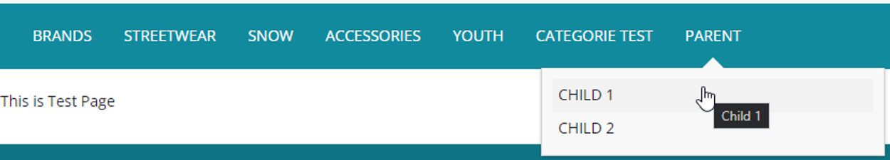

# (WCMS) Création d’un node parent et un node enfant


### Création du node parent

Création  de `CMSNavigationNode` avec le nom `ParentCategoryNode`

```xml
INSERT_UPDATE CMSNavigationNode	;uid[unique=true]	;$contentCV[unique=true] ;name ;parent(uid, $contentCV) ;links(&linkRef) ;&nodeRef
;ParentCategoryNode	;;Parent Category Node ;ApparelUKCategoryNavNode ;;ParentCategoryNode
```

Création de  `CMSNavigationEntry` avec le nom `CategoryNavigationEntry`

```xml
INSERT_UPDATE CMSNavigationEntry;uid[unique=true]	;$contentCV[unique=true];name	;navigationNode(&nodeRef)	;item(CMSLinkComponent.uid,CMSLinkComponent.$contentCV);
;CategoryNavigationEntry	;;Category Navigation Entry	;ParentCategoryNode	;CategoryLinkComponent;
```

Création de `CMSLinkComponent` avec le nom `CategoryLinkComponent` 

```xml
INSERT_UPDATE CMSLinkComponent	;$contentCV[unique=true];uid[unique=true]	;name	;url ;category(code, $productCV);target(code)[default='sameWindow'];;
;;CategoryLinkComponent ;Category Link	Component ;/test ;;;;
```

Faire la localisation de `CMSNavigationNode` et `CMSLinkComponent`

```xml
UPDATE CMSNavigationNode ;$contentCV[unique=true];uid[unique=true] ;title[lang=en]
;;ParentCategoryNode ;"Parent"

UPDATE CMSLinkComponent	;$contentCV[unique=true];uid[unique=true] ;linkName[lang=en]
;;CategoryLinkComponent	;"Parent"
```

### Création du node enfant

Création de  `CMSNavigationNode` avec le nom `ChildCategoryNode`  pour lier `CMSNavigationNode` parent `ParentCategoryNode`  avec les enfants `ChildCategorie-1` & `ChildCategorie-2`

```xml
INSERT_UPDATE CMSNavigationNode	;uid[unique=true]	;$contentCV[unique=true];name	;parent(uid, $contentCV) ;&nodeRef ; Children(uid,$contentCV); links(&linkRef);
;ChildCategoryNode ;;Child Category Node ;ParentCategoryNode ;ChildCategoryNode	;ChildCategorie-1, ChildCategorie-2
```

Création  de `CMSNavigationNode` avec le nom `ChildCategorie`-1 & `ChildCategorie-2`

```xml
INSERT_UPDATE CMSNavigationNode	;uid[unique=true]	;$contentCV[unique=true];name ;&nodeRef ;links(&linkRef)
;ChildCategorie-1 ;;Child Categorie 1	;ChildCategorie-1
;ChildCategorie-2	;;Child Categorie 2	;ChildCategorie-2
```

Création  de `CMSNavigationEntry`

```xml
INSERT_UPDATE CMSNavigationEntry;uid[unique=true]	 ;$contentCV[unique=true];name ;navigationNode(&nodeRef) ;item(CMSLinkComponent.uid,CMSLinkComponent.$contentCV);
;ChildCategorie-1-Entry	;;Child Category 1 Entry ;ChildCategorie-1	;ChildCategorie-1-Link
;ChildCategorie-2-Entry	;;Child Category 2 Entry ;ChildCategorie-1	;ChildCategorie-2-Link
```

Création   de `CMSLinkComponent` 

```xml
INSERT_UPDATE CMSLinkComponent ;$contentCV[unique=true];uid[unique=true]	;name ;url ;category(code, $productCV)	;target(code)[default='sameWindow'];;
;;ChildCategorie-1-Link	;Child Category 1 Link Component ;/test	;;;;
;;ChildCategorie-2-Link	;Child Category 2 Link Component ;/test	;;;;
```

Faire la localisation de `CMSNavigationNode` et `CMSLinkComponent`

```xml
UPDATE CMSNavigationNode ;$contentCV[unique=true];uid[unique=true]	;title[lang=en]
;;ChildCategorie-1 ;"Child 1"
;;ChildCategorie-2 ;"Child 2"

UPDATE CMSLinkComponent	;$contentCV[unique=true];uid[unique=true]	;linkName[lang=en]
;;ChildCategorie-1-Link ;"Child 1"
;;ChildCategorie-2-Link ;"Child 2"
```

**Impex complet :**

```xml
$contentCatalog=apparel-ukContentCatalog
$contentCV=catalogVersion(CatalogVersion.catalog(Catalog.id[default=$contentCatalog]),CatalogVersion.version[default=Online])[default=$contentCatalog:Online]
$productCatalog=apparelProductCatalog
$productCatalogName=Apparel Product Catalog
$productCV=catalogVersion(catalog(id[default=$productCatalog]),version[default='Online'])[unique=true,default=$productCatalog:Online]
$lang=en


# Parent NAV

INSERT_UPDATE CMSNavigationNode	;uid[unique=true]	;$contentCV[unique=true];name	;parent(uid, $contentCV) ; links(&linkRef)	;&nodeRef
;ParentCategoryNode ;;Parent Category Node	;ApparelUKCategoryNavNode	;;ParentCategoryNode

INSERT_UPDATE CMSNavigationEntry;uid[unique=true]			;$contentCV[unique=true];name ;navigationNode(&nodeRef)	;item(CMSLinkComponent.uid,CMSLinkComponent.$contentCV);
;CategoryNavigationEntry;;Category Navigation Entry ;ParentCategoryNode ;CategoryLinkComponent;
								
INSERT_UPDATE CMSLinkComponent	;$contentCV[unique=true];uid[unique=true]	;name	;url	;category(code, $productCV);target(code)[default='sameWindow'];;
;;CategoryLinkComponent	;Category Link	Component;/test	;;;;
					
UPDATE CMSNavigationNode	;$contentCV[unique=true];uid[unique=true]		;title[lang=en]
;;ParentCategoryNode ;"Parent"

UPDATE CMSLinkComponent	;$contentCV[unique=true];uid[unique=true]	;linkName[lang=en]
;;CategoryLinkComponent	;"Parent"


# child NAV

INSERT_UPDATE CMSNavigationNode	;uid[unique=true]	;$contentCV[unique=true];name	;parent(uid, $contentCV) ;&nodeRef 			; Children(uid,$contentCV); links(&linkRef);
;ChildCategoryNode ;;Child Category Node	;ParentCategoryNode	 ;ChildCategoryNode	;ChildCategorie-1, ChildCategorie-2
								
INSERT_UPDATE CMSNavigationNode	;uid[unique=true]	;$contentCV[unique=true];name	;&nodeRef ;links(&linkRef)
;ChildCategorie-1	;;Child Categorie 1	;ChildCategorie-1
;ChildCategorie-2	;;Child Categorie 2	;ChildCategorie-2
								
INSERT_UPDATE CMSNavigationEntry;uid[unique=true]	;$contentCV[unique=true];name ;navigationNode(&nodeRef)	;item(CMSLinkComponent.uid,CMSLinkComponent.$contentCV);
;ChildCategorie-1-Entry	;;Child Category 1 Entry	;ChildCategorie-1			;ChildCategorie-1-Link
;ChildCategorie-2-Entry	;;Child Category 2 Entry	;ChildCategorie-1			;ChildCategorie-2-Link
			
INSERT_UPDATE CMSLinkComponent ;$contentCV[unique=true];uid[unique=true]	;name	;url ;category(code, $productCV) ;target(code)[default='sameWindow'];;
;;ChildCategorie-1-Link	;Child Category 1 Link Component ;/test	;;;;
;;ChildCategorie-2-Link	;Child Category 2 Link Componen ;/test	;;;;
								
UPDATE CMSNavigationNode	;$contentCV[unique=true];uid[unique=true] ;title[lang=en]
;;ChildCategorie-1 ;"Child 1"
;;ChildCategorie-2;"Child 2"

UPDATE CMSLinkComponent	;$contentCV[unique=true];uid[unique=true]	;linkName[lang=en]
;;ChildCategorie-1-Link	;"Child 1"
;;ChildCategorie-2-Link	;"Child 2"
```

**Notre Contrôleur** 

chemin : web/src/de/hybris/myproject/storefront/controllers/pages/TestPageController.java

```java
package de.hybris.myproject.storefront.controllers.pages;

import de.hybris.platform.acceleratorstorefrontcommons.controllers.pages.AbstractPageController;
import de.hybris.platform.cms2.exceptions.CMSItemNotFoundException;
import de.hybris.platform.cms2.model.pages.ContentPageModel;
import org.springframework.context.annotation.Scope;
import org.springframework.stereotype.Controller;
import org.springframework.web.bind.annotation.RequestMapping;
import org.springframework.web.bind.annotation.RequestMethod;
import org.springframework.ui.Model;
@Controller
@Scope("tenant")
@RequestMapping("/test")
public class TestPageController extends AbstractPageController {
    private static final StringTEST_CMS_PAGE= "testCMSPage";

    @RequestMapping(method = RequestMethod.GET)
    public String getTest(final Model model) throws  CMSItemNotFoundException {
        final ContentPageModel testCMSPage = getContentPageForLabelOrId(TEST_CMS_PAGE);
        storeCmsPageInModel(model,testCMSPage);
        setUpMetaDataForContentPage(model,testCMSPage);
        return getViewForPage(model);
    }
}

```

**Notre JSP** 

chemin : web/webroot/WEB-INF/views/responsive/pages/test/testLayoutPage.jsp

```html
<%@ taglib prefix="c" uri="http://java.sun.com/jsp/jstl/core" %>
<%@ page trimDirectiveWhitespaces="true" %>
<%@ taglib prefix="template" tagdir="/WEB-INF/tags/responsive/template" %>
<%@ taglib prefix="cms" uri="http://hybris.com/tld/cmstags" %>

<template:page pageTitle="${pageTitle}">

    <cms:pageSlot position="testParagraph" var="feature" element="div" class="testBannerParagraph">
        <cms:component component="${feature}"/>
    </cms:pageSlot>

</template:page>
```

**Résultat :**



 **Sources :**
- https://hybrisinstructive.blogspot.com/search/label/WCMS in hybris  
- https://hybrisdiary.wordpress.com/2018/07/01/navigation-management-in-sap-hybris-commerce/
- http://everyreply.blogspot.com/2016/09/impex-for-component-banner-image.html