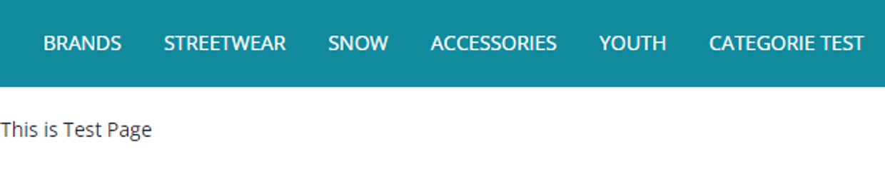

# (WCMS) Création d’un nouveau onglet et integration d’une page et d’une paragraphe

## Création de notre nouvelle page avec un nouveaux node

Création de `PageTemplate` avec le nom `testPageTemplate` ici `testLayoutPage` c’est le nom de notre JSP qu’on va créé

```sql
INSERT_UPDATE PageTemplate ;$contentCV[unique=true] ;uid[unique=true] ;name ;frontendTemplateName ;restrictedPageTypes(code) ;active[default=true]

;;testPageTemplate ;test Page Template  ;test/testLayoutPage ;ContentPage
```

Création de `ContentPage` avec le nom `testContentPage` qui utilise le modèle `TestPageTemplate` ici `testCMSPagec`’est le nom de Label CMS qu’on utilise dans le contrôleur

```
INSERT_UPDATE ContentPage  ;$contentCV[unique=true] ;uid[unique=true]; name ;masterTemplate(uid,$contentCV) ;label ;defaultPage[default='true'] ;approvalStatus(code)[default='approved'] ;homepage[default='false']

;;testContentPage ;test Content Page ;testPageTemplate ;testCMSPage
```

Création de `ContentSlotName` pour définir tout ce qui as dans mon template

```sql
INSERT_UPDATE ContentSlotName  ;name[unique=true];template(uid,$contentCV)[unique=true][default='testPageTemplate'];validComponentTypes(code);compTypeGroup(code)
;TopHeaderSlot;;;wide
;SiteLogo;;;logo
;HeaderLinks;;;headerlinks
;SearchBox;;;searchbox
;MiniCart;;;minicart
;NavigationBar;;;navigation
;Footer;;;footer
;testParagraph;;;wide
```

Création du `ContentSlotForTemplate` qui contient le mappage entre `ContentSlot` et `ContentSlotName`

```
INSERT_UPDATE ContentSlotForTemplate;$contentCV[unique=true];uid[unique=true] ;position[unique=true] ;pageTemplate(uid,$contentCV)[unique=true][default='testPageTemplate']  ;contentSlot(uid,$contentCV)[unique=true];allowOverwrite
;;SiteLogo-TestPage ;SiteLogo ;;SiteLogoSlot;true
;;HomepageLink-TestPage ;HomepageNavLink ;;HomepageNavLinkSlot;true
;;NavigationBar-TestPage ;NavigationBar ;;NavigationBarSlot;true
;;MiniCart-TestPage ;MiniCart ;;MiniCartSlot;true
;;Footer-TestPage ;Footer ;;FooterSlot;true
;;HeaderLinks-TestPage ;HeaderLinks ;;HeaderLinksSlot;true
;;SearchBox-TestPage ;SearchBox ;;SearchBoxSlot;true
;;TopHeaderSlot-TestPage ;TopHeaderSlot ;;TopHeaderSlot;true
;;BottomHeaderSlot-TestPage ;BottomHeaderSlot ;;BottomHeaderSlot;true
;;testParagraphSlot-TestPage ;testParagraph ;;testContentSlot;true
```

Création de `CMSParagraphComponent`

```sql
INSERT_UPDATE CMSParagraphComponent ;$contentCV[unique=true] ;uid[unique=true] ;name ;&componentRef ;;;;content;
;;testCMSParagraphComponent ;test CMS Paragraph Component ;testCMSParagraphComponent ;;;;This is Test Page;
```

Création du `ContentSlot` avec le nom "`testContentSlot` " qui est lié a `CMSParagraphComponent` "`testCMSParagraphComponent`"

```impex
INSERT_UPDATE ContentSlot ;$contentCV[unique=true] ;uid[unique=true] ;name ;active ;cmsComponents(uid,$contentCV)
;;testContentSlot ;test Content Slot ;true ;testCMSParagraphComponent
```

Création du `ContentSlotForPage` pour lié `ContentSlot` ”`testContentSlot`” ici `testParagraph` c’est le nom du CMS appeler dans la JSP

```sql
INSERT_UPDATE ContentSlotForPage;$contentCV[unique=true];uid[unique=true] ;position[unique=true] ;page(uid,$contentCV)[unique=true][default='testContentPage'] ;contentSlot(uid,$contentCV)[unique=true];;;
;;testContentSlotForPage ;testParagraph ;;testContentSlot
```

Création du `CMSNavigationNode` "`testCMSNavigationNode`”

> **definition** : CMSNavigationNode représente un nœud de navigation dans la hiérarchie de navigation d'un site Web. Il peut contenir un lien vers une page ou un autre nœud de navigation.

```sql
INSERT_UPDATE CMSNavigationNode ;uid[unique=true] ;$contentCV[unique=true] ;name ;&nodeRef;
;testCMSNavigationNode ;;test CMS Navigation Node ;testCMSNavigationNode
```

Création du `CMSNavigationNode` qui permet d'ajouter "`testCMSNavigationNode`

```sql
INSERT_UPDATE CMSNavigationNode ;uid[unique=true] ;$contentCV[unique=true];name ;parent(uid, $contentCV);&nodeRef ;children(uid,$contentCV)
;ApparelUKCategoryNavNode ;;Categories ;ApparelUKNavNode ;ApparelUKCategoryNavNode  ;BrandsNavNode,StreetwearNavigationNode,SnowNavigationNode,AccessoriesNavigationNode,StreetwearYouthNavNode,testCMSNavigationNode
```

Création du `CMSLinkComponent` le component qui sera lié a `contentSlot`

> definition : CMSLinkComponent représente un lien hypertexte vers une autre page ou un autre site Web. Il peut être utilisé dans un composant CMS pour fournir des liens cliquables dans le contenu de la page.

```
INSERT_UPDATE CMSLinkComponent  ;$contentCV[unique=true];uid[unique=true] ;name ;url ;category(code, $productCV) ;target(code)[default='sameWindow']  ;;
;;testCMSLinkComponent ;test CMS Link Component ;/test  ;;;;
```

Création de `CMSNavigationEntry` "`TestNavNodeEntry`" qui est lié a `CMSNavigationNode` "`TestNavigationNavNode`”

> definition : CMSNavigationEntry représente une entrée de navigation dans une structure de navigation. Il peut être utilisé pour créer des menus de navigation déroulants ou des arbres de navigation dans une page Web.

```
INSERT_UPDATE CMSNavigationEntry;uid[unique=true]  ;$contentCV[unique=true];name ;navigationNode(&nodeRef)  ;item(CMSLinkComponent.uid,CMSLinkComponent.$contentCV);
;testCMSNavigationEntry ;;test CMS Navigation Entry;testCMSNavigationNode  ;testCMSLinkComponent;
```

Faire la localisation de `CMSNavigationNode` et `CMSLinkComponent`

```
UPDATE CMSNavigationNode ;$contentCV[unique=true];uid[unique=true] ;title[lang=en]
;;testCMSNavigationNode ;"Categorie Test"

UPDATE CMSLinkComponent ;$contentCV[unique=true];uid[unique=true] ;linkName[lang=en]
;;testCMSLinkComponent ;"Categorie Test"
```

**Notre Contrôleur**

chemin : web/src/de/hybris/myproject/storefront/controllers/pages/TestPageController.java

```Java
package de.hybris.myproject.storefront.controllers.pages;

import de.hybris.platform.acceleratorstorefrontcommons.controllers.pages.AbstractPageController;
import de.hybris.platform.cms2.exceptions.CMSItemNotFoundException;
import de.hybris.platform.cms2.model.pages.ContentPageModel;
import org.springframework.context.annotation.Scope;
import org.springframework.stereotype.Controller;
import org.springframework.web.bind.annotation.RequestMapping;
import org.springframework.web.bind.annotation.RequestMethod;
import org.springframework.ui.Model;
@Controller
@Scope("tenant")
@RequestMapping("/test")
public class TestPageController extends AbstractPageController {
    private static final String TEST_CMS_PAGE= "testCMSPage";

    @RequestMapping(method = RequestMethod.GET)
    public String getTest(final Model model) throws  CMSItemNotFoundException {
        final ContentPageModel testCMSPage = getContentPageForLabelOrId(TEST_CMS_PAGE);
        storeCmsPageInModel(model,testCMSPage);
        setUpMetaDataForContentPage(model,testCMSPage);
        return getViewForPage(model);
    }
}

```

**Notre JSP**

```html
<%@ taglib prefix="c" uri="http://java.sun.com/jsp/jstl/core" %>
<%@ page trimDirectiveWhitespaces="true" %>
<%@ taglib prefix="template" tagdir="/WEB-INF/tags/responsive/template" %>
<%@ taglib prefix="cms" uri="http://hybris.com/tld/cmstags" %>

<template:page pageTitle="${pageTitle}">

    <cms:pageSlot position="testParagraph" var="feature" element="div" class="testBannerParagraph">
        <cms:component component="${feature}"/>
    </cms:pageSlot>

</template:page>
    
```

Impex Complet :

```impex
$contentCatalog=apparel-ukContentCatalog
$contentCV=catalogVersion(CatalogVersion.catalog(Catalog.id[default=$contentCatalog]),CatalogVersion.version[default=Online])[default=$contentCatalog:Online]
$productCatalog=apparelProductCatalog
$productCatalogName=Apparel Product Catalog
$productCV=catalogVersion(catalog(id[default=$productCatalog]),version[default='Online'])[unique=true,default=$productCatalog:Online]
$lang=en


INSERT_UPDATE PageTemplate ;$contentCV[unique=true] ;uid[unique=true] ;name ;frontendTemplateName ;restrictedPageTypes(code) ;active[default=true]
;;testPageTemplate ;test Page Template  ;test/testLayoutPage ;ContentPage


INSERT_UPDATE ContentPage  ;$contentCV[unique=true] ;uid[unique=true]; name ;masterTemplate(uid,$contentCV) ;label ;defaultPage[default='true'] ;approvalStatus(code)[default='approved'] ;homepage[default='false']
;;testContentPage ;test Content Page ;testPageTemplate ;testCMSPage


INSERT_UPDATE ContentSlotName  ;name[unique=true];template(uid,$contentCV)[unique=true][default='testPageTemplate'];validComponentTypes(code);compTypeGroup(code)
;TopHeaderSlot;;;wide
;SiteLogo;;;logo
;HeaderLinks;;;headerlinks
;SearchBox;;;searchbox
;MiniCart;;;minicart
;NavigationBar;;;navigation
;Footer;;;footer
;testParagraph;;;wide
                

INSERT_UPDATE ContentSlotForTemplate;$contentCV[unique=true];uid[unique=true] ;position[unique=true] ;pageTemplate(uid,$contentCV)[unique=true][default='testPageTemplate']  ;contentSlot(uid,$contentCV)[unique=true];allowOverwrite
;;SiteLogo-TestPage ;SiteLogo ;;SiteLogoSlot;true
;;HomepageLink-TestPage ;HomepageNavLink ;;HomepageNavLinkSlot;true
;;NavigationBar-TestPage ;NavigationBar ;;NavigationBarSlot;true
;;MiniCart-TestPage ;MiniCart ;;MiniCartSlot;true
;;Footer-TestPage ;Footer ;;FooterSlot;true
;;HeaderLinks-TestPage ;HeaderLinks ;;HeaderLinksSlot;true
;;SearchBox-TestPage ;SearchBox ;;SearchBoxSlot;true
;;TopHeaderSlot-TestPage ;TopHeaderSlot ;;TopHeaderSlot;true
;;BottomHeaderSlot-TestPage ;BottomHeaderSlot ;;BottomHeaderSlot;true
;;testParagraphSlot-TestPage ;testParagraph ;;testContentSlot;true


INSERT_UPDATE CMSParagraphComponent ;$contentCV[unique=true] ;uid[unique=true] ;name ;&componentRef ;;;;content;
;;testCMSParagraphComponent ;test CMS Paragraph Component ;testCMSParagraphComponent ;;;;This is Test Page;
 


INSERT_UPDATE ContentSlot ;$contentCV[unique=true] ;uid[unique=true] ;name ;active ;cmsComponents(uid,$contentCV)
;;testContentSlot ;test Content Slot ;true ;testCMSParagraphComponent

INSERT_UPDATE ContentSlotForPage;$contentCV[unique=true];uid[unique=true] ;position[unique=true] ;page(uid,$contentCV)[unique=true][default='testContentPage'] ;contentSlot(uid,$contentCV)[unique=true];;;
;;testContentSlotForPage ;testParagraph ;;testContentSlot


 
INSERT_UPDATE CMSNavigationNode ;uid[unique=true] ;$contentCV[unique=true] ;name ;&nodeRef;
;testCMSNavigationNode ;;test CMS Navigation Node ;testCMSNavigationNode

 
INSERT_UPDATE CMSNavigationNode ;uid[unique=true] ;$contentCV[unique=true];name ;parent(uid, $contentCV);&nodeRef ;children(uid,$contentCV)
;ApparelUKCategoryNavNode ;;Categories ;ApparelUKNavNode ;ApparelUKCategoryNavNode  ;BrandsNavNode,StreetwearNavigationNode,SnowNavigationNode,AccessoriesNavigationNode,StreetwearYouthNavNode,testCMSNavigationNode


INSERT_UPDATE CMSLinkComponent  ;$contentCV[unique=true];uid[unique=true] ;name ;url ;category(code, $productCV) ;target(code)[default='sameWindow']  ;;
;;testCMSLinkComponent ;test CMS Link Component ;/test  ;;;;


INSERT_UPDATE CMSNavigationEntry;uid[unique=true]  ;$contentCV[unique=true];name            ;navigationNode(&nodeRef)  ;item(CMSLinkComponent.uid,CMSLinkComponent.$contentCV);
;testCMSNavigationEntry  ;;test CMS Navigation Entry;testCMSNavigationNode    ;testCMSLinkComponent;

UPDATE CMSNavigationNode ;$contentCV[unique=true];uid[unique=true] ;title[lang=en]
;;testCMSNavigationNode ;"Categorie Test"

UPDATE CMSLinkComponent ;$contentCV[unique=true];uid[unique=true] ;linkName[lang=en]
;;testCMSLinkComponent ;"Categorie Test"
```

**Résultat :**  


- **Sources :**
    - [](https://hybrisinstructive.blogspot.com/search/label/WCMS%20in%20hybris)https://hybrisinstructive.blogspot.com/search/label/WCMS in hybris
    - https://hybrisdiary.wordpress.com/2018/07/01/navigation-management-in-sap-hybris-commerce/
    - http://everyreply.blogspot.com/2016/09/impex-for-component-banner-image.html
    - https://www.youtube.com/watch?v=PmpE5l5SzlY&t=1224s