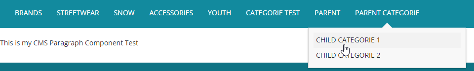

# (WCMS) création de template + catégorie Parent & enfant 
### création de template

Création de `PageTemplate` avec le nom `PageTemplateTest` ici `testLayoutPage` c’est le nom de notre JSP qu’on va créé

```xml
INSERT_UPDATE PageTemplate ;$contentCV[unique=true] ;uid[unique=true] ;name ;frontendTemplateName ;restrictedPageTypes(code) ;active[default=true]
;;PageTemplateTest ;Page Template Test ;test/testLayoutPage	;ContentPage
```

Création de `ContentPage` avec le nom `ContentPageTest` qui utilise le modèle `PageTemplateTest` ici `testCMSPage` c’est le nom de Label CMS qu’on utilise dans le contrôleur 

```xml
INSERT_UPDATE ContentPage ;$contentCV[unique=true] ;uid[unique=true] ;name ;masterTemplate(uid,$contentCV) ;label ;defaultPage[default='true'] ;approvalStatus(code)[default='approved'] ;homepage[default='false']
;;ContentPageTest ;Content Page Test ;PageTemplateTest ;testCMSPage
```

Création de `ContentSlotName`  pour définir tout ce qui a dans mon template

```xml
INSERT_UPDATE ContentSlotName	;name[unique=true];template(uid,$contentCV)[unique=true][default='PageTemplateTest'];validComponentTypes(code);compTypeGroup(code)
;TopHeaderSlot;;;wide
;SiteLogo;;;logo
;HeaderLinks;;;headerlinks
;SearchBox;;;searchbox
;MiniCart;;;minicart
;NavigationBar;;;navigation
;Footer;;;footer
#;testParagraph;;;wide
```

Création du `ContentSlotForTemplate` qui contient le mappage entre `ContentSlot` et `ContentSlotName`

```xml
INSERT_UPDATE ContentSlotForTemplate;$contentCV[unique=true];uid[unique=true] ;position[unique=true] ;pageTemplate(uid,$contentCV)[unique=true][default='PageTemplateTest']	;contentSlot(uid,$contentCV)[unique=true];allowOverwrite
;;SiteLogo-PageTest ;SiteLogo ;;SiteLogoSlot;true
;;HomepageLink-PageTest ;HomepageNavLink ;;HomepageNavLinkSlot;true
;;NavigationBar-PageTest ;NavigationBar ;;NavigationBarSlot;true
;;MiniCart-PageTest ;MiniCart ;;MiniCartSlot;true
;;Footer-PageTest ;Footer ;;FooterSlot;true
;;HeaderLinks-PageTest ;HeaderLinks ;;HeaderLinksSlot;true
;;SearchBox-PageTest ;SearchBox ;;SearchBoxSlot;true
;;TopHeaderSlot-PageTest ;TopHeaderSlot ;;TopHeaderSlot;true
;;BottomHeaderSlot-PageTest ;BottomHeaderSlot ;;BottomHeaderSlot;true
#;;testParagraphSlot-PageTest ;testParagraph ;;testParagraphSlot;true
```

Création de  `CMSParagraphComponent`

```xml
INSERT_UPDATE CMSParagraphComponent	;$contentCV[unique=true] ;uid[unique=true] ;name ;&componentRef ;;;;content;
;;CMSParagraphComponentTest	;CMS Paragraph Component Test ;CMSParagraphComponentTest	;;;;This is my CMS Paragraph Component Test;
```

Création du `ContentSlot` avec le nom "`ContentSlotCMSParagraphComponentTest`" qui est lié a `CMSParagraphComponent` "`CMSParagraphComponentTest`”

```xml
INSERT_UPDATE ContentSlot ;$contentCV[unique=true] ;uid[unique=true] ;name ;active ;cmsComponents(uid,$contentCV
;;ContentSlotCMSParagraphComponentTest	;Content Slot CMS Paragraph Component Test ;true ;CMSParagraphComponentTest
```

Création du `ContentSlotForPage` **pour lié** `ContentSlot`  ”`ContentSlotForPageContentSlotCMSParagraphComponentTest`”, ici `testParagraph` c’est le nom du CMS appeler dans la JSP

```xml
INSERT_UPDATE ContentSlotForPage;$contentCV[unique=true];uid[unique=true] ;position[unique=true] ;page(uid,$contentCV)[unique=true][default='ContentPageTest'] ;contentSlot(uid,$contentCV)[unique=true];;;
;;ContentSlotForPageContentSlotCMSParagraphComponentTest ;testParagraph; ;ContentSlotCMSParagraphComponentTest
```

### Création du node Parent

Création du `CMSNavigationNode` "`CMSNavigationNodeParent` ”

```xml
INSERT_UPDATE CMSNavigationNode	;uid[unique=true] ;$contentCV[unique=true];name ;parent(uid, $contentCV) ;links(&linkRef)	;&nodeRef
;CMSNavigationNodeParent ;;CMS Navigation Node Parent ;ApparelUKCategoryNavNode	;;CMSNavigationNodeParent
```

Création de `CMSNavigationEntry` "`CMSNavigationEntryParent` "

```xml
INSERT_UPDATE CMSNavigationEntry;uid[unique=true] ;$contentCV[unique=true];name ;navigationNode(&nodeRef)	;item(CMSLinkComponent.uid,CMSLinkComponent.$contentCV);
;CMSNavigationEntryParent ;;CMS Navigation Entry Parent ;CMSNavigationNodeParent ;CMSLinkComponentParent;
```

Création du `CMSLinkComponent`  le component qui sera lié a `contentSlot`

```xml
INSERT_UPDATE CMSLinkComponent	;$contentCV[unique=true];uid[unique=true] ;name ;url ;category(code, $productCV);target(code)[default='sameWindow'];;
;;CMSLinkComponentParent ;CMS Link Component Parent	;/test ;;;;
```

Faire la localisation de `CMSNavigationNode` et `CMSLinkComponent`

```xml
UPDATE CMSNavigationNode ;$contentCV[unique=true];uid[unique=true] ;title[lang=en]
;;CMSNavigationNodeParent ;"Parent Categorie"

UPDATE CMSLinkComponent	;$contentCV[unique=true];uid[unique=true] ;linkName[lang=en]
;;CMSLinkComponentParent ;"Parent Categorie"
```

### Création du node enfant

Création du `CMSNavigationNode`

```xml
INSERT_UPDATE CMSNavigationNode	;uid[unique=true]		;$contentCV[unique=true];name ;parent(uid, $contentCV) ;&nodeRef ;Children(uid,$contentCV); links(&linkRef);
;CMSNavigationNodeChild	;;CMS Navigation Node Child	;CMSNavigationNodeParent ;CMSNavigationNodeChild ;CMSNavigationNodeChild1, CMSNavigationNodeChild2
```

Création du `CMSNavigationNode`

```xml
INSERT_UPDATE CMSNavigationNode	;uid[unique=true] ;$contentCV[unique=true];name ;&nodeRef ; links(&linkRef)
;CMSNavigationNodeChild1 ;;CMS Navigation Node Child 1 ;CMSNavigationNodeChild1
;CMSNavigationNodeChild2 ;;CMS Navigation Node Child 2;CMSNavigationNodeChild2
```

Création du `CMSNavigationNode`

```xml
INSERT_UPDATE CMSNavigationEntry;uid[unique=true] ;$contentCV[unique=true];name ;navigationNode(&nodeRef) ;item(CMSLinkComponent.uid,CMSLinkComponent.$contentCV);
;CMSNavigationEntryChild1 ;;CMS Navigation Entry Child 1 ;CMSNavigationNodeChild1 ;CMSLinkComponentChild1
;CMSNavigationEntryChild2 ;;CMS Navigation Entry Child 2 ;CMSNavigationNodeChild2 ;CMSLinkComponentChild2
```

Création du `CMSNavigationNode`

```xml
INSERT_UPDATE CMSLinkComponent	;$contentCV[unique=true];uid[unique=true] ;name ;url ;category(code, $productCV)	;target(code)[default='sameWindow'];;
;;CMSLinkComponentChild1 ;CMS Link Component Child 1 ;/test	;;;;
;;CMSLinkComponentChild2 ;CMS Link Component Child 2 ;/test	;;;;
```

Faire la localisation de `CMSNavigationNode` et `CMSLinkComponent`

```xml
UPDATE CMSNavigationNode ;$contentCV[unique=true];uid[unique=true] ;title[lang=en]
;;CMSNavigationNodeChild1 ;"Child Categorie 1"
;;CMSNavigationNodeChild2 ;"Child Categorie 2"

UPDATE CMSLinkComponent	;$contentCV[unique=true];uid[unique=true] ;linkName[lang=en]
;;CMSLinkComponentChild1 ;"Child Categorie 1"
;;CMSLinkComponentChild2 ;"Child Categorie 2"
```

**Impex complet :**

```xml
$contentCatalog=apparel-ukContentCatalog
$contentCV=catalogVersion(CatalogVersion.catalog(Catalog.id[default=$contentCatalog]),CatalogVersion.version[default=Online])[default=$contentCatalog:Online]
$productCatalog=apparelProductCatalog
$productCatalogName=Apparel Product Catalog
$productCV=catalogVersion(catalog(id[default=$productCatalog]),version[default='Online'])[unique=true,default=$productCatalog:Online]
$lang=en

# Temmplate page + CMSParagraph

INSERT_UPDATE PageTemplate	;$contentCV[unique=true]	;uid[unique=true]	;name;frontendTemplateName	;restrictedPageTypes(code)	;active[default=true]
;;PageTemplateTest	;Page Template Test	;test/testLayoutPage	;ContentPage

INSERT_UPDATE ContentPage	;$contentCV[unique=true]	;uid[unique=true]	;name;masterTemplate(uid,$contentCV)	;label		;defaultPage[default='true'];approvalStatus(code)[default='approved']	;homepage[default='false']
;;ContentPageTest	;Content Page Test	;PageTemplateTest;testCMSPage

INSERT_UPDATE ContentSlotName	;name[unique=true];template(uid,$contentCV)[unique=true][default='PageTemplateTest'];validComponentTypes(code);compTypeGroup(code)
;TopHeaderSlot;;;wide
;SiteLogo;;;logo
;HeaderLinks;;;headerlinks
;SearchBox;;;searchbox
;MiniCart;;;minicart
;NavigationBar;;;navigation
;Footer;;;footer
#;testParagraph;;;wide
								
INSERT_UPDATE ContentSlotForTemplate;$contentCV[unique=true];uid[unique=true]			;position[unique=true]	;pageTemplate(uid,$contentCV)[unique=true][default='PageTemplateTest'];contentSlot(uid,$contentCV)[unique=true];allowOverwrite
;;SiteLogo-PageTest;SiteLogo;;SiteLogoSlot;true
;;HomepageLink-PageTest;HomepageNavLink;;HomepageNavLinkSlot;true
;;NavigationBar-PageTest;NavigationBar;;NavigationBarSlot;true
;;MiniCart-PageTest;MiniCart;;MiniCartSlot;true
;;Footer-PageTest;Footer;;FooterSlot;true
;;HeaderLinks-PageTest;HeaderLinks;;HeaderLinksSlot;true
;;SearchBox-PageTest;SearchBox;;SearchBoxSlot;true
;;TopHeaderSlot-PageTest;TopHeaderSlot;;TopHeaderSlot;true
;;BottomHeaderSlot-PageTest	;BottomHeaderSlot;;BottomHeaderSlot;true
#;;testParagraphSlot-PageTest	;testParagraph;;testParagraphSlot;true

INSERT_UPDATE CMSParagraphComponent	;$contentCV[unique=true]	;uid[unique=true];name;&componentRef;;;;content;
;;CMSParagraphComponentTest	;CMS Paragraph Component Test	;CMSParagraphComponentTest	;;;;This is my CMS Paragraph Component Test;
 
INSERT_UPDATE ContentSlot	;$contentCV[unique=true];uid[unique=true]	;name;active	;cmsComponents(uid,$contentCV)
;;ContentSlotCMSParagraphComponentTest	;Content Slot CMS Paragraph Component Test	;true	;CMSParagraphComponentTest

INSERT_UPDATE ContentSlotForPage;$contentCV[unique=true];uid[unique=true];position[unique=true]	;page(uid,$contentCV)[unique=true][default='ContentPageTest']	;contentSlot(uid,$contentCV)[unique=true];;;
;;ContentSlotForPageContentSlotCMSParagraphComponentTest	;testParagraph;;ContentSlotCMSParagraphComponentTest

# Parent NAV

INSERT_UPDATE CMSNavigationNode	;uid[unique=true]			;$contentCV[unique=true];name;parent(uid,$contentCV);links(&linkRef)	;&nodeRef
;CMSNavigationNodeParent	;;CMS Navigation Node Parent	;ApparelUKCategoryNavNode	;;	CMSNavigationNodeParent

INSERT_UPDATE CMSNavigationEntry;uid[unique=true]			;$contentCV[unique=true];name;navigationNode(&nodeRef)	;item(CMSLinkComponent.uid,CMSLinkComponent.$contentCV);
;CMSNavigationEntryParent	;;CMS Navigation Entry Parent;CMSNavigationNodeParent;CMSLinkComponentParent;
								
INSERT_UPDATE CMSLinkComponent	;$contentCV[unique=true];uid[unique=true]		;name;url;category(code, $productCV);target(code)[default='sameWindow'];;
;;CMSLinkComponentParent;CMS Link Component Parent	;/test	;;;;
					
UPDATE CMSNavigationNode	;$contentCV[unique=true];uid[unique=true]		;title[lang=en]
;;CMSNavigationNodeParent;"Parent Categorie"

UPDATE CMSLinkComponent	;$contentCV[unique=true];uid[unique=true]	;linkName[lang=en]
;;CMSLinkComponentParent;"Parent Categorie"
								
# child NAV

INSERT_UPDATE CMSNavigationNode	;uid[unique=true]		;$contentCV[unique=true];name;parent(uid,$contentCV);&nodeRef; Children(uid,$contentCV); links(&linkRef);
;CMSNavigationNodeChild	;;CMS Navigation	Node Child	;CMSNavigationNodeParent;CMSNavigationNodeChild	; CMSNavigationNodeChild1, CMSNavigationNodeChild2
								
INSERT_UPDATE CMSNavigationNode	;uid[unique=true]			;$contentCV[unique=true];name;&nodeRef;links(&linkRef)
;CMSNavigationNodeChild1;;CMS Navigation Node Child 1 	;CMSNavigationNodeChild1
;CMSNavigationNodeChild2;;CMS Navigation Node Child 2	;CMSNavigationNodeChild2
								
INSERT_UPDATE CMSNavigationEntry;uid[unique=true]				;$contentCV[unique=true];name;navigationNode(&nodeRef)	;item(CMSLinkComponent.uid,CMSLinkComponent.$contentCV);
;CMSNavigationEntryChild1;;CMS Navigation Entry Child 1	;CMSNavigationNodeChild1;CMSLinkComponentChild1
;CMSNavigationEntryChild2;;CMS Navigation Entry Child 2	;CMSNavigationNodeChild2;CMSLinkComponentChild2
			
INSERT_UPDATE CMSLinkComponent	;$contentCV[unique=true];uid[unique=true]		;name;url;category(code,$productCV);target(code)[default='sameWindow'];;
;;CMSLinkComponentChild1; CMS Link Component Child 1	;/test	;;;;
;;CMSLinkComponentChild2; CMS Link Component Child 2	;/test	;;;;
								
UPDATE CMSNavigationNode	;$contentCV[unique=true];uid[unique=true]	;title[lang=en]
;;CMSNavigationNodeChild1; "Child Categorie 1"
;;CMSNavigationNodeChild2; "Child Categorie 2"

UPDATE CMSLinkComponent	;$contentCV[unique=true];uid[unique=true]		;linkName[lang=en]
;;CMSLinkComponentChild1; "Child Categorie 1"
;;CMSLinkComponentChild2; "Child Categorie 2"
```

**Notre Contrôleur** 

chemin : web/src/de/hybris/myproject/storefront/controllers/pages/TestPageController.java

```java
package de.hybris.myproject.storefront.controllers.pages;

import de.hybris.platform.acceleratorstorefrontcommons.controllers.pages.AbstractPageController;
import de.hybris.platform.cms2.exceptions.CMSItemNotFoundException;
import de.hybris.platform.cms2.model.pages.ContentPageModel;
import org.springframework.context.annotation.Scope;
import org.springframework.stereotype.Controller;
import org.springframework.web.bind.annotation.RequestMapping;
import org.springframework.web.bind.annotation.RequestMethod;
import org.springframework.ui.Model;
@Controller
@Scope("tenant")
@RequestMapping("/test")
public class TestPageController extends AbstractPageController {
    private static final StringTEST_CMS_PAGE= "testCMSPage";

    @RequestMapping(method = RequestMethod.GET)
    public String getTest(final Model model) throws  CMSItemNotFoundException {
        final ContentPageModel testCMSPage = getContentPageForLabelOrId(TEST_CMS_PAGE);
        storeCmsPageInModel(model,testCMSPage);
        setUpMetaDataForContentPage(model,testCMSPage);
        return getViewForPage(model);
    }
}

```

**Notre JSP** 

chemin : web/webroot/WEB-INF/views/responsive/pages/test/testLayoutPage.jsp

```html
<%@ taglib prefix="c" uri="http://java.sun.com/jsp/jstl/core" %>
<%@ page trimDirectiveWhitespaces="true" %>
<%@ taglib prefix="template" tagdir="/WEB-INF/tags/responsive/template" %>
<%@ taglib prefix="cms" uri="http://hybris.com/tld/cmstags" %>

<template:page pageTitle="${pageTitle}">

    <cms:pageSlot position="testParagraph" var="feature" element="div" class="testBannerParagraph">
        <cms:component component="${feature}"/>
    </cms:pageSlot>

</template:page>
```

**Résultat :**



**Sources :**

- [https://hybrisinstructive.blogspot.com/search/label/WCMS in hybris](https://hybrisinstructive.blogspot.com/search/label/WCMS%20in%20hybris)
- https://hybrisdiary.wordpress.com/2018/07/01/navigation-management-in-sap-hybris-commerce/
- http://everyreply.blogspot.com/2016/09/impex-for-component-banner-image.html
- https://www.youtube.com/watch?v=PmpE5l5SzlY&t=1224s