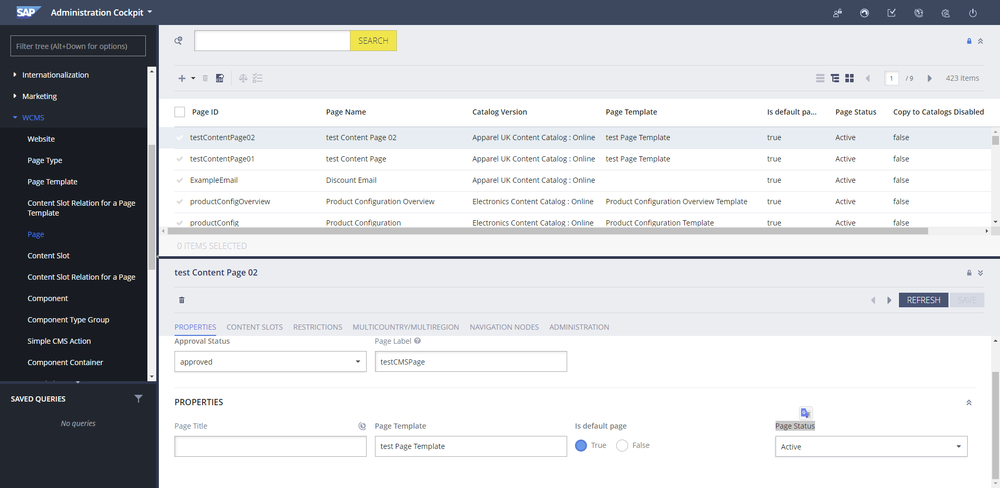
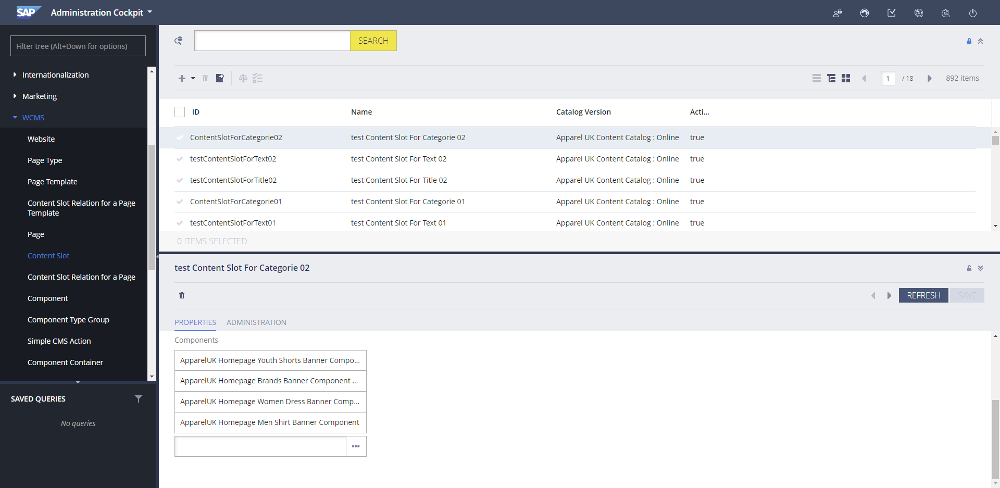
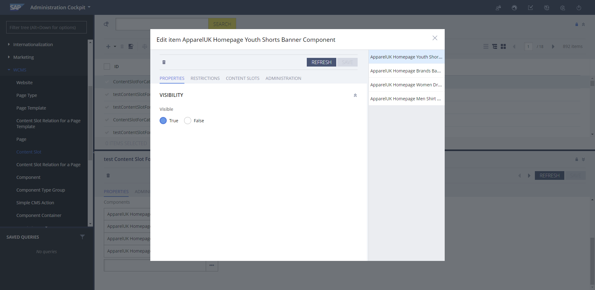

création de la page Template 

```xml
INSERT_UPDATE PageTemplate ;$contentCV[unique=true] ;uid[unique=true] ;name ;frontendTemplateName ;restrictedPageTypes(code) ;active[default=true]
;;testPageTemplate ;test Page Template  ;test/testLayoutPage ;ContentPage

INSERT_UPDATE ContentSlotName  ;name[unique=true];template(uid,$contentCV)[unique=true][default='testPageTemplate'];validComponentTypes(code);compTypeGroup(code)
;TopHeaderSlot;;;wide
;SiteLogo;;;logo
;HeaderLinks;;;headerlinks
;SearchBox;;;searchbox
;MiniCart;;;minicart
;NavigationBar;;;navigation
;Footer;;;footer

INSERT_UPDATE ContentSlotForTemplate;$contentCV[unique=true];uid[unique=true] ;position[unique=true] ;pageTemplate(uid,$contentCV)[unique=true][default='testPageTemplate']  ;contentSlot(uid,$contentCV)[unique=true];allowOverwrite
;;SiteLogo-TestPage ;SiteLogo ;;SiteLogoSlot;true
;;HomepageLink-TestPage ;HomepageNavLink ;;HomepageNavLinkSlot;true
;;NavigationBar-TestPage ;NavigationBar ;;NavigationBarSlot;true
;;MiniCart-TestPage ;MiniCart ;;MiniCartSlot;true
;;Footer-TestPage ;Footer ;;FooterSlot;true
;;HeaderLinks-TestPage ;HeaderLinks ;;HeaderLinksSlot;true
;;SearchBox-TestPage ;SearchBox ;;SearchBoxSlot;true
;;TopHeaderSlot-TestPage ;TopHeaderSlot ;;TopHeaderSlot;true
;;BottomHeaderSlot-TestPage ;BottomHeaderSlot ;;BottomHeaderSlot;true
```

---

création du premier **`ContentPage`** `testContentPage01` 

```xml
INSERT_UPDATE ContentPage  ;$contentCV[unique=true] ;uid[unique=true]; name ;masterTemplate(uid,$contentCV) ;label ;defaultPage[default='true'] ;approvalStatus(code)[default='approved'] ;homepage[default='false']
;;testContentPage01 ;test Content Page ;testPageTemplate ;testCMSPage
```

création du paragraphe qui contient le **titre** pour `testContentPage01` 

```xml
INSERT_UPDATE CMSParagraphComponent ;$contentCV[unique=true] ;uid[unique=true] ;name ;&componentRef ;;;;content[lang=en];
;;testCMSParagraphComponentForTitle01 ;test CMS Paragraph Component For Title 01;testCMSParagraphComponentForTitle01 ;;;;I am test TITLE 01;

INSERT_UPDATE ContentSlot ;$contentCV[unique=true] ;uid[unique=true] ;name ;active ;cmsComponents(uid,$contentCV)
;;testContentSlotForTitle01 ;test Content Slot For Title 01;true ;testCMSParagraphComponentForTitle01

INSERT_UPDATE ContentSlotForPage;$contentCV[unique=true];uid[unique=true] ;position[unique=true] ;page(uid,$contentCV)[unique=true][default='testContentPage01'] ;contentSlot(uid,$contentCV)[unique=true];;;
;;testContentSlotForPageForTitle01 ;testForTitle ;;testContentSlotForTitle01
```

création du paragraphe qui contient le **texte** pour `testContentPage01` 

```xml
INSERT_UPDATE CMSParagraphComponent ;$contentCV[unique=true] ;uid[unique=true] ;name ;&componentRef ;;;;content[lang=en];
;;testCMSParagraphComponentForText01 ;test CMS Paragraph Component For Text 01;testCMSParagraphComponentForText01  ;;;; I am test TEXT 1 <br> I am test TEXT 2 <br> I am test TEXT 3 <br> I am test TEXT 4 <br> I am test TEXT 5  ;
 
INSERT_UPDATE ContentSlot ;$contentCV[unique=true] ;uid[unique=true] ;name ;active ;cmsComponents(uid,$contentCV)
;;testContentSlotForText01  ;test Content Slot For Text 01 ;true ;testCMSParagraphComponentForText01 

INSERT_UPDATE ContentSlotForPage;$contentCV[unique=true];uid[unique=true] ;position[unique=true] ;page(uid,$contentCV)[unique=true][default='testContentPage01'] ;contentSlot(uid,$contentCV)[unique=true];;;
;;testContentSlotForPageForText01  ;testForText ;;testContentSlotForText01
```

création du paragraphe qui contient les **catégories** pour `testContentPage01` 

```xml
INSERT_UPDATE ContentSlot; $contentCV[unique = true]; uid[unique = true] ;name ;active     ; cmsComponents(uid, $contentCV)
                         ;                          ; ContentSlotForCategorie01 ;test Content Slot For Categorie 01 ;true; ApparelUKHomepageWomenStreetBannerComponent,ApparelUKHomepageMenStreetBannerComponent,ApparelUKHomepageStreetYouthBannerComponent,ApparelUKHomepageBrandsBannerComponent

INSERT_UPDATE ContentSlotForPage;$contentCV[unique=true];uid[unique=true] ;position[unique=true] ;page(uid,$contentCV)[unique=true][default='testContentPage01'] ;contentSlot(uid,$contentCV)[unique=true];;;
;;testContentSlotForNavForCategorie01 ;testForCategorie ;;ContentSlotForCategorie01
```

---

création du premier **`ContentPage`** `testContentPage02` 

```xml
INSERT_UPDATE ContentPage  ;$contentCV[unique=true] ;uid[unique=true]; name ;masterTemplate(uid,$contentCV) ;label ;defaultPage[default='true'] ;approvalStatus(code)[default='approved'] ;homepage[default='false']
;;testContentPage02 ;test Content Page 02;testPageTemplate ;testCMSPage
```

création du paragraphe qui contient le **titre** pour `testContentPage02` 

```xml
INSERT_UPDATE CMSParagraphComponent ;$contentCV[unique=true] ;uid[unique=true] ;name ;&componentRef ;;;;content[lang=en];
;;testCMSParagraphComponentForTitle02;test CMS Paragraph Component For Title 02 ;testCMSParagraphComponentForTitle02 ;;;;I am test TITLE 02;
 
INSERT_UPDATE ContentSlot ;$contentCV[unique=true] ;uid[unique=true] ;name ;active ;cmsComponents(uid,$contentCV)
;;testContentSlotForTitle02  ;test Content Slot For Title 02  ;true ;testCMSParagraphComponentForTitle02 

INSERT_UPDATE ContentSlotForPage;$contentCV[unique=true];uid[unique=true] ;position[unique=true] ;page(uid,$contentCV)[unique=true][default='testContentPage02'] ;contentSlot(uid,$contentCV)[unique=true];;;
;;testContentSlotForPageForTitle02  ;testForTitle ;;testContentSlotForTitle02
```

création du paragraphe qui contient le **texte** pour `testContentPage02` 

```xml
INSERT_UPDATE CMSParagraphComponent ;$contentCV[unique=true] ;uid[unique=true] ;name ;&componentRef ;;;;content[lang=en];
;;testCMSParagraphComponentForText02 ;test CMS Paragraph Component For Text 02;testCMSParagraphComponentForText02 ;;;; I am test 02 TEXT 1 <br> I am test 02 TEXT 2 <br> I am test 02 TEXT 3 <br> I am test 02 TEXT 4 <br> I am test 02 TEXT 5  ;
 
INSERT_UPDATE ContentSlot ;$contentCV[unique=true] ;uid[unique=true] ;name ;active ;cmsComponents(uid,$contentCV)
;;testContentSlotForText02 ;test Content Slot For Text 02;true ;testCMSParagraphComponentForText02

INSERT_UPDATE ContentSlotForPage;$contentCV[unique=true];uid[unique=true] ;position[unique=true] ;page(uid,$contentCV)[unique=true][default='testContentPage02'] ;contentSlot(uid,$contentCV)[unique=true];;;
;;testContentSlotForPageForText02 ;testForText ;;testContentSlotForText02
```

création du paragraphe qui contient les **catégories** pour `testContentPage02` 

```xml
INSERT_UPDATE ContentSlot; $contentCV[unique = true]; uid[unique = true] ;name ;active; cmsComponents(uid, $contentCV)
;; ContentSlotForCategorie02 ;test Content Slot For Categorie 02 ;true; ApparelUKHomepageStreetYouthBannerComponent,ApparelUKHomepageBrandsBannerComponent,ApparelUKHomepageWomenStreetBannerComponent,ApparelUKHomepageMenStreetBannerComponent

INSERT_UPDATE ContentSlotForPage;$contentCV[unique=true];uid[unique=true] ;position[unique=true] ;page(uid,$contentCV)[unique=true][default='testContentPage02'] ;contentSlot(uid,$contentCV)[unique=true];;;
;;testContentSlotForPageForCategorie02 ;testForCategorie ;;ContentSlotForCategorie02
```

---

création du node `Categorie Test`

```xml
INSERT_UPDATE CMSNavigationNode ;uid[unique=true] ;$contentCV[unique=true] ;name ;&nodeRef;
;testCMSNavigationNode ;;test CMS Navigation Node ;testCMSNavigationNode

 
INSERT_UPDATE CMSNavigationNode ;uid[unique=true] ;$contentCV[unique=true];name ;parent(uid, $contentCV);&nodeRef ;children(uid,$contentCV)
;ApparelUKCategoryNavNode ;;Categories ;ApparelUKNavNode ;ApparelUKCategoryNavNode  ;BrandsNavNode,StreetwearNavigationNode,SnowNavigationNode,AccessoriesNavigationNode,StreetwearYouthNavNode,testCMSNavigationNode

INSERT_UPDATE CMSLinkComponent  ;$contentCV[unique=true];uid[unique=true] ;name ;url ;category(code, $productCV) ;target(code)[default='sameWindow']  ;;
;;testCMSLinkComponent ;test CMS Link Component ;/test  ;;;;

INSERT_UPDATE CMSNavigationEntry;uid[unique=true]  ;$contentCV[unique=true];name;navigationNode(&nodeRef)  ;item(CMSLinkComponent.uid,CMSLinkComponent.$contentCV);
;testCMSNavigationEntry  ;;test CMS Navigation Entry;testCMSNavigationNode;testCMSLinkComponent;

UPDATE CMSNavigationNode ;$contentCV[unique=true];uid[unique=true] ;title[lang=en]
;;testCMSNavigationNode ;"Categorie Test"

UPDATE CMSLinkComponent ;$contentCV[unique=true];uid[unique=true] ;linkName[lang=en]
;;testCMSLinkComponent ;"Categorie Test"
```

---

**impex complet :**

```html
contentCatalog=apparel-ukContentCatalog
$contentCV=catalogVersion(CatalogVersion.catalog(Catalog.id[default=$contentCatalog]),CatalogVersion.version[default=Online])[default=$contentCatalog:Online]
$productCatalog=apparelProductCatalog
$productCatalogName=Apparel Product Catalog
$productCV=catalogVersion(catalog(id[default=$productCatalog]),version[default='Online'])[unique=true,default=$productCatalog:Online]
$lang=en

###################################################

INSERT_UPDATE PageTemplate ;$contentCV[unique=true] ;uid[unique=true] ;name ;frontendTemplateName ;restrictedPageTypes(code) ;active[default=true
;;testPageTemplate ;test Page Template  ;test/testLayoutPage ;ContentPage

INSERT_UPDATE ContentSlotName  ;name[unique=true];template(uid,$contentCV)[unique=true][default='testPageTemplate'];validComponentTypes(code);compTypeGroup(code)
;TopHeaderSlot;;;wide
;SiteLogo;;;logo
;HeaderLinks;;;headerlinks
;SearchBox;;;searchbox
;MiniCart;;;minicart
;NavigationBar;;;navigation
;Footer;;;footer

INSERT_UPDATE ContentSlotForTemplate;$contentCV[unique=true];uid[unique=true] ;position[unique=true] ;pageTemplate(uid,$contentCV)[unique=true][default='testPageTemplate']  ;contentSlot(uid,$contentCV)[unique=true];allowOverwrite
;;SiteLogo-TestPage ;SiteLogo ;;SiteLogoSlot;true
;;HomepageLink-TestPage ;HomepageNavLink ;;HomepageNavLinkSlot;true
;;NavigationBar-TestPage ;NavigationBar ;;NavigationBarSlot;true
;;MiniCart-TestPage ;MiniCart ;;MiniCartSlot;true
;;Footer-TestPage ;Footer ;;FooterSlot;true
;;HeaderLinks-TestPage ;HeaderLinks ;;HeaderLinksSlot;true
;;SearchBox-TestPage ;SearchBox ;;SearchBoxSlot;true
;;TopHeaderSlot-TestPage ;TopHeaderSlot ;;TopHeaderSlot;true
;;BottomHeaderSlot-TestPage ;BottomHeaderSlot ;;BottomHeaderSlot;true

###################################################

INSERT_UPDATE ContentPage  ;$contentCV[unique=true] ;uid[unique=true]; name ;masterTemplate(uid,$contentCV) ;label ;defaultPage[default='true'] ;approvalStatus(code)[default='approved'] ;homepage[default='false']
;;testContentPage01 ;test Content Page ;testPageTemplate ;testCMSPage

###

INSERT_UPDATE CMSParagraphComponent ;$contentCV[unique=true] ;uid[unique=true] ;name ;&componentRef ;;;;content[lang=en];
;;testCMSParagraphComponentForTitle01 ;test CMS Paragraph Component For Title 01;testCMSParagraphComponentForTitle01 ;;;;I am test TITLE 01;

INSERT_UPDATE ContentSlot ;$contentCV[unique=true] ;uid[unique=true] ;name ;active ;cmsComponents(uid,$contentCV)
;;testContentSlotForTitle01 ;test Content Slot For Title 01;true ;testCMSParagraphComponentForTitle01

INSERT_UPDATE ContentSlotForPage;$contentCV[unique=true];uid[unique=true] ;position[unique=true] ;page(uid,$contentCV)[unique=true][default='testContentPage01'] ;contentSlot(uid,$contentCV)[unique=true];;;
;;testContentSlotForPageForTitle01 ;testForTitle ;;testContentSlotForTitle01

###

INSERT_UPDATE CMSParagraphComponent ;$contentCV[unique=true] ;uid[unique=true] ;name ;&componentRef ;;;;content[lang=en];
;;testCMSParagraphComponentForText01 ;test CMS Paragraph Component For Text 01;testCMSParagraphComponentForText01  ;;;; I am test TEXT 1 <br> I am test TEXT 2 <br> I am test TEXT 3 <br> I am test TEXT 4 <br> I am test TEXT 5  ;
 
INSERT_UPDATE ContentSlot ;$contentCV[unique=true] ;uid[unique=true] ;name ;active ;cmsComponents(uid,$contentCV)
;;testContentSlotForText01  ;test Content Slot For Text 01 ;true ;testCMSParagraphComponentForText01 

INSERT_UPDATE ContentSlotForPage;$contentCV[unique=true];uid[unique=true] ;position[unique=true] ;page(uid,$contentCV)[unique=true][default='testContentPage01'] ;contentSlot(uid,$contentCV)[unique=true];;;
;;testContentSlotForPageForText01  ;testForText ;;testContentSlotForText01 

###

INSERT_UPDATE ContentSlot; $contentCV[unique = true]; uid[unique = true] ;name ;active; cmsComponents(uid, $contentCV)
;; ContentSlotForCategorie01 ;test Content Slot For Categorie 01 ;true; ApparelUKHomepageWomenStreetBannerComponent,ApparelUKHomepageMenStreetBannerComponent,ApparelUKHomepageStreetYouthBannerComponent,ApparelUKHomepageBrandsBannerComponent

INSERT_UPDATE ContentSlotForPage;$contentCV[unique=true];uid[unique=true] ;position[unique=true] ;page(uid,$contentCV)[unique=true][default='testContentPage01'] ;contentSlot(uid,$contentCV)[unique=true];;;
;;testContentSlotForNavForCategorie01 ;testForCategorie ;;ContentSlotForCategorie01

###################################################

INSERT_UPDATE ContentPage  ;$contentCV[unique=true] ;uid[unique=true]; name ;masterTemplate(uid,$contentCV) ;label ;defaultPage[default='true'] ;approvalStatus(code)[default='approved'] ;homepage[default='false']
;;testContentPage02 ;test Content Page 02;testPageTemplate ;testCMSPage

###

INSERT_UPDATE CMSParagraphComponent ;$contentCV[unique=true] ;uid[unique=true] ;name ;&componentRef ;;;;content[lang=en];
;;testCMSParagraphComponentForTitle02;test CMS Paragraph Component For Title 02 ;testCMSParagraphComponentForTitle02 ;;;;I am test TITLE 02;
 
INSERT_UPDATE ContentSlot ;$contentCV[unique=true] ;uid[unique=true] ;name ;active ;cmsComponents(uid,$contentCV)
;;testContentSlotForTitle02  ;test Content Slot For Title 02  ;true ;testCMSParagraphComponentForTitle02 

INSERT_UPDATE ContentSlotForPage;$contentCV[unique=true];uid[unique=true] ;position[unique=true] ;page(uid,$contentCV)[unique=true][default='testContentPage02'] ;contentSlot(uid,$contentCV)[unique=true];;;
;;testContentSlotForPageForTitle02  ;testForTitle ;;testContentSlotForTitle02 

###

INSERT_UPDATE CMSParagraphComponent ;$contentCV[unique=true] ;uid[unique=true] ;name ;&componentRef ;;;;content[lang=en];
;;testCMSParagraphComponentForText02 ;test CMS Paragraph Component For Text 02;testCMSParagraphComponentForText02 ;;;; I am test 02 TEXT 1 <br> I am test 02 TEXT 2 <br> I am test 02 TEXT 3 <br> I am test 02 TEXT 4 <br> I am test 02 TEXT 5  ;
 
INSERT_UPDATE ContentSlot ;$contentCV[unique=true] ;uid[unique=true] ;name ;active ;cmsComponents(uid,$contentCV)
;;testContentSlotForText02 ;test Content Slot For Text 02;true ;testCMSParagraphComponentForText02

INSERT_UPDATE ContentSlotForPage;$contentCV[unique=true];uid[unique=true] ;position[unique=true] ;page(uid,$contentCV)[unique=true][default='testContentPage02'] ;contentSlot(uid,$contentCV)[unique=true];;;
;;testContentSlotForPageForText02 ;testForText ;;testContentSlotForText02

###
INSERT_UPDATE ContentSlot; $contentCV[unique = true]; uid[unique = true] ;name ;active; cmsComponents(uid, $contentCV)
;; ContentSlotForCategorie02 ;test Content Slot For Categorie 02 ;true; ApparelUKHomepageStreetYouthBannerComponent,ApparelUKHomepageBrandsBannerComponent,ApparelUKHomepageWomenStreetBannerComponent,ApparelUKHomepageMenStreetBannerComponent

INSERT_UPDATE ContentSlotForPage;$contentCV[unique=true];uid[unique=true] ;position[unique=true] ;page(uid,$contentCV)[unique=true][default='testContentPage02'] ;contentSlot(uid,$contentCV)[unique=true];;;
;;testContentSlotForPageForCategorie02 ;testForCategorie ;;ContentSlotForCategorie02

###################################################

INSERT_UPDATE CMSNavigationNode ;uid[unique=true] ;$contentCV[unique=true] ;name ;&nodeRef;
;testCMSNavigationNode ;;test CMS Navigation Node ;testCMSNavigationNode


INSERT_UPDATE CMSNavigationNode ;uid[unique=true] ;$contentCV[unique=true];name ;parent(uid, $contentCV);&nodeRef ;children(uid,$contentCV)
;ApparelUKCategoryNavNode ;;Categories ;ApparelUKNavNode ;ApparelUKCategoryNavNode  ;BrandsNavNode,StreetwearNavigationNode,SnowNavigationNode,AccessoriesNavigationNode,StreetwearYouthNavNode,testCMSNavigationNode

INSERT_UPDATE CMSLinkComponent  ;$contentCV[unique=true];uid[unique=true] ;name ;url ;category(code, $productCV) ;target(code)[default='sameWindow']  ;;
;;testCMSLinkComponent ;test CMS Link Component ;/test  ;;;;

INSERT_UPDATE CMSNavigationEntry;uid[unique=true]  ;$contentCV[unique=true];name;navigationNode(&nodeRef)  ;item(CMSLinkComponent.uid,CMSLinkComponent.$contentCV);
;testCMSNavigationEntry  ;;test CMS Navigation Entry;testCMSNavigationNode;testCMSLinkComponent;

UPDATE CMSNavigationNode ;$contentCV[unique=true];uid[unique=true] ;title[lang=en]
;;testCMSNavigationNode ;"Categorie Test"

UPDATE CMSLinkComponent ;$contentCV[unique=true];uid[unique=true] ;linkName[lang=en]
;;testCMSLinkComponent ;"Categorie Test"

###################################################
###################################################

INSERT_UPDATE SimpleResponsiveBannerComponent;$contentCV[unique=true];uid[unique=true];name;urlLink;&componentRef
;;TestSimpleResponsiveBannerComponentForTest01;Test Simple Responsive Banner Component For Test 01;https://www.google.fr/ ; TestSimpleResponsiveBannerComponentForTest01

INSERT_UPDATE SimpleResponsiveBannerComponent;$contentCV[unique=true];uid[unique=true];$mediaContainer
;;TestSimpleResponsiveBannerComponentForTest01;testMediaContainerForTest01

INSERT_UPDATE MediaContainer;qualifier[unique=true];$medias;$contentCV[unique=true]
;testMediaContainerForTest01;Appa_200x240_Youth_EN_01_200W.jpg,Appa_240x290_Youth_EN_01_240W.jpg,Appa_350x430_Youth_EN_01_350W.jpg
```

---

**Notre Contrôleur** 

chemin : web/src/de/hybris/myproject/storefront/controllers/pages/TestPageController.java

```java
package de.hybris.myproject.storefront.controllers.pages;

import de.hybris.platform.acceleratorstorefrontcommons.controllers.pages.AbstractPageController;
import de.hybris.platform.cms2.exceptions.CMSItemNotFoundException;
import de.hybris.platform.cms2.model.pages.ContentPageModel;
import org.springframework.context.annotation.Scope;
import org.springframework.stereotype.Controller;
import org.springframework.web.bind.annotation.RequestMapping;
import org.springframework.web.bind.annotation.RequestMethod;
import org.springframework.ui.Model;
@Controller
@Scope("tenant")
@RequestMapping("/test")
public class TestPageController extends AbstractPageController {
    private static final StringTEST_CMS_PAGE= "testCMSPage";

    @RequestMapping(method = RequestMethod.GET)
    public String getTest(final Model model) throws  CMSItemNotFoundException {
        final ContentPageModel testCMSPage = getContentPageForLabelOrId(TEST_CMS_PAGE);
        storeCmsPageInModel(model,testCMSPage);
        setUpMetaDataForContentPage(model,testCMSPage);
        return getViewForPage(model);
    }
}

```

---

**Notre JSP** 

chemin : web/webroot/WEB-INF/views/responsive/pages/test/testLayoutPage.jsp

```html
<%@ taglib prefix="c" uri="http://java.sun.com/jsp/jstl/core" %>
<%@ page trimDirectiveWhitespaces="true" %>
<%@ taglib prefix="template" tagdir="/WEB-INF/tags/responsive/template" %>
<%@ taglib prefix="cms" uri="http://hybris.com/tld/cmstags" %>

<template:page pageTitle="${pageTitle}">

    <div>
        <h1>
            <cms:pageSlot position="testForTitle" var="feature" element="div" class="testBannerParagraph">
                <cms:component component="${feature}"/>
            </cms:pageSlot>
        </h1>
    </div>

    <div>
        <p>
            <cms:pageSlot position="testForText" var="feature" element="div" class="testBannerParagraph">
                <cms:component component="${feature}"/>
            </cms:pageSlot>
        </p>
    </div>

    <div>
        <cms:pageSlot position="testForCategorie" var="feature" element="div" class="row no-margin">
            <cms:component component="${feature}" element="div" class=" col-xs-6 col-md-3 no-space yComponentWrapper"/>
        </cms:pageSlot>
    </div>
    
</template:page>
```

---

**Résultat :**  

`ContentPage` : `testContentPage01`


`ContentPage` : `testContentPage02` 


Afin de choisir quelle page afficher sur note catégorie Test il faut aller dans le `backoffice → WCMS →page` ensuite choisir notre `ContentPage` et changer notre `Page Status`



Afin d’afficher ou de masquer des catégories il faut aller `backoffice → WCMS → Content Slot`   ensuit choir notre `ContentSlotForPage`





- **Sources :**
    - [https://hybrisinstructive.blogspot.com/search/label/WCMS in hybris](https://hybrisinstructive.blogspot.com/search/label/WCMS%20in%20hybris)
    - https://hybrisdiary.wordpress.com/2018/07/01/navigation-management-in-sap-hybris-commerce/
    - http://everyreply.blogspot.com/2016/09/impex-for-component-banner-image.html
    - https://www.youtube.com/watch?v=PmpE5l5SzlY&t=1224s